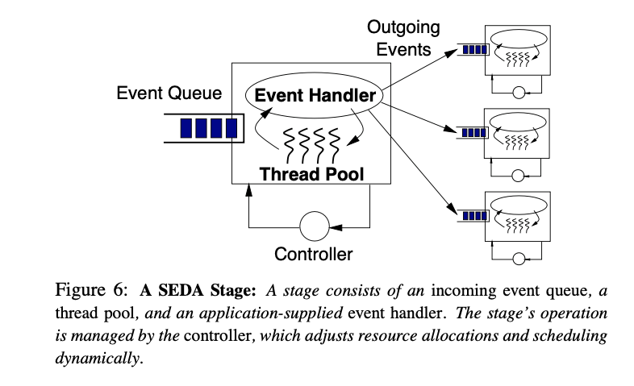
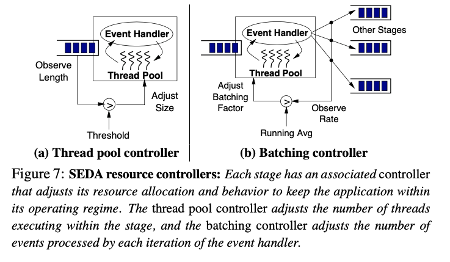

# SEDA: An Architecture for Well-Conditioned, Scalable Internet Services

Link: https://sosp.org/2001/papers/welsh.pdf

Read: June 16th, 10:41AM. 

This paper presents staged event-driven architecture (SEDA), a new design for highly concurrent Internet services. SEDA is intended to support massive concurrency demands and simplify constructions of well-conditioned services.

The key innovations include a combination of thread-based and event-based model, and use resource allocators to adapt resources at each stage according to the workloads. 

Application consist of network of event-driven stages connected by explicit queues. SEDA uses a dynamic resource controllers to keep stages within their operating regime. 

Key components include 
1. **Stages**: The application is divided into multiple stages, each associated with an incoming event queue.
2. **Dynamic Resource Controllers**: Controllers dynamically adjust the number of threads and the batching sizes within each stage to adapt to workload changes.
3. Explicit Queues: Interconnect different stages to buffer and manage events.
4. Asynchronous I/O Primitives: Non-blocking I/O operations to keep the system responsive.

## Limitations 
Cons of overall event-based system include the difficulty to understand cause-effect relationship, and stack ripping (i.e. manually save and restore live state is a pain). The trade-offs were mentioned in the Cappricio paper. 

## Key Insight

### Motivation

- Internet: unprecedented ***scale***, millions of users demanding access
    - Services must be responsive, robust, and always responsible
- Three trends magnify the system challenge
    1. Services become more complex
        1. Static content replaced by dynamic content, extensive computation and I/O
    2. Service logic tends to change rapidly 
        1. Increase engineering complexity and deployment  
    3. Services increasingly hosted on general-purpose facilities 
        1. Rather than carefully-engineered platform

### Baselines

- Commodity OS: maximal transparency
    - *Process and thread*: high context switch overhead and memory footprint
    - *Transparent resource virtualization*: vital to managing excessive load

### Thread-based concurrency

- E.x. RPC, RCOM
- Each accepted request consumes a thread to process it, with sync operations protecting shared resources.
- **Pros:** ease-to-program
- **Cons**
    - Overhead with threading: cache and TLB misses, scheduling overhead, lock contention
    - Overhead gets worse with large # of threads
    - Not adequate for the tremendous concurrency requirements of an Internet service.
- Why?
    - OS is built for virtualize resources in a way that is transparent to the user
    - Applications rarely participate in resource management decisions to adopt their behaviors with changing conditions
- Other thread-based technique comparison
    - Giving application ability to specialize policy decisions made by kernel
        - E.x. Scheduler activations [5], application-specific handlers [59], and operating systems such as SPIN [11], Exokernel [28], and Nemesis [34]
        - Cons
            - Still based on multiprogramming
            - Focus on safe and efficient resource virtualization rather than graceful management and high concurrency
    - Bounded thread pool
        - Bound size of thread pool associated with a service, additional connections not accepted
        - Cons: unfairness  to clients (i.e. client requests queue up in network)

### Event-based concurrency

- A server consists of a small # of threads (i.e. one per CPU) that loop continuously, processing events of different types from a queue
- Processing of each task is a **finite state machine (FSM)**
    - Transition between state in FSM are triggered by events
    - E.x. each component of the server is some particular types of events like socket connections or FS access, server is dispatching event to each of these components
- E.x. used by web servers, Flash, Zeus
- **Pros:** robust to load
- **Cons**
    - Assume event-handling threads do not block, so nonblocking I/O mechanisms must be employed
        - But this is not true, e.x. interrupts, page faults, garbage collection
        - ^ For these reasons, event-handling threads can still block. 
    - Additional challenges
        - Scheduling and ordering of events are hard for application
        - Modularity is difficult to achieve
            - Code implements each state must be trusted not to block
            - Or consume large # of resources that stall the event-handling thread
- Some better solutions: structured event queues
    - Structure an event-driven application using a set of event queues to improve code modularities and simplify application design
    - E.x. Click, DDS

## Key Techniques

### Goals

1. Support massive concurrency 
    1. Use event-driven execution whenever possible 
2. Simplify construction of well-conditioned services 
    1. Allow modular construction of application 
3. Enable introspection 
    1. Applications can analyze request stream to adapt behavior of changing loads 
4. Support self-tuning resource management 
    1. Adjust resource management parameters dynamically to meet performance target (i.e. # of threads per stage) 

### Key Ideas

- Staged event-driven architecture (SEDA)
    - Combine threads and event-based programming model
    - Applications are constructed as network of *stages*
        - Each associated with *incoming event queue* (explicit)
        - Stage threads pull batch of events off the incoming event queue
        - And invoke application-supplied event handler
        - The event handler processes each batch of event, and dispatches 0 or more event by queueing them on event queues of other stages
    - Use *dynamic resource throttling*
        - Each stage is managed by a controller that affects scheduling and thread allocation
- 
- 

### Details

1. **Resource controllers**
    1. ***Thread pool controller***: adjust # of threads executing within each stage 
        1. Goal: enough thread to handle concurrency demands 
        2. Periodically sample input queue and add a thread when the queue length exceeds some threshold 
        3. Threads are removed when they are idle for a specified period of time 
    2. ***Batching controller***: adjust # of events processed by each invocation of the event handler within a stage 
        1. I.e. processing many event at once v.s less 
        2. Throughput v.s. Response Time tradeoff
        3. Observes output rate of events from a stage (by maintaining moving average across samples), and decreases batching factor until throughput starts to degrade 
        4. Responds to sudden drops in load by resetting batching factor to max 
    3. The SEDA asynchronous sockets library, described in the next section, contains an optional controller that throt- tles the rate at which packets are read from the network. 
    3. Note 
        1. Applications adapt despite the algorithm used by OS, SEDA is not aware of OS thread scheduling policy 
2. **Async I/O primitives** 
    1. Async network socket layer: make use of non-blocking I/O provided by OS (i.e. /dev/poll) 
        1. *readStage*: perform socket read whenever an I/O readiness event indicates that a socket has data available 
        2. *writeStage:* receives packet write requests from the user and enqueues them onto an internal queue associated with the particular socket 
        3. *listenStage*: accepts new TCP connections and responds to user requests to listen on a new port 
    2. Async file I/O layer: use blocking OS call and thread pool to expose nonblocking behavior 
        1. OS does not provide nonblocking file I/O primitives 
        2. How: make use of blocking I/O and bounded thread pool 
        3. Note: only one thread may process events for a particular file at a time to ensure multiple I/O executes serially

## Discussion

We believe that measurement and control is the key to resource man- agement and overload protection in busy Internet services. This is in contrast to long-standing approaches based on resource containment, which assign fixed resources to each task (such as a process, thread, or server request) in the system, and strive to contain the resources con- sumed by each task.

## Limitations

Rather this might be concerns over event-based system as well:

1. Difficult to understand the cause-effect relationship 
    1. I.e. when examining source code or debugging, event system invoke a method in another module by sending “call” event and waiting for a “return” event in response. Programmer needs to manually match these pairs in order to understand the application. 
2. Manually save and restore live state is a pain 
    1. V.s. thread-based system: each thread maintains its own stack, which simplify the state management