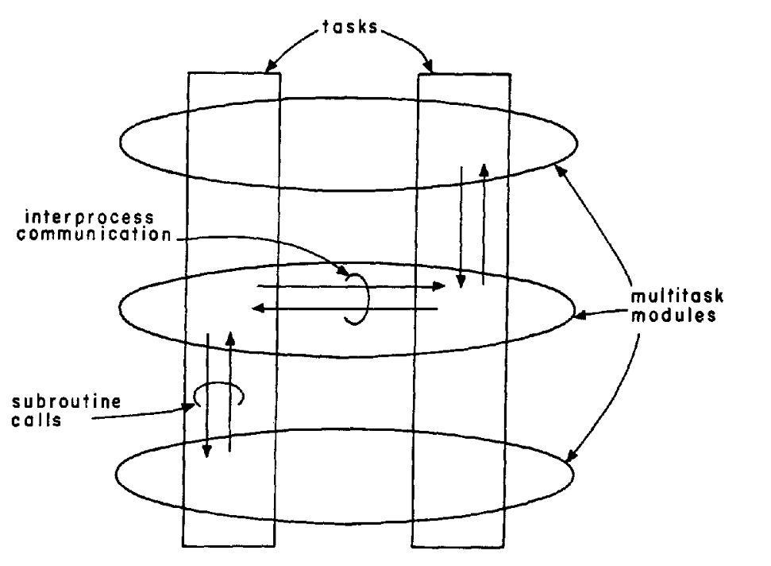

# The Structuring of Systems Using Upcalls (1985)

Read: June 17th, 2024.

Link: https://dl.acm.org/doi/pdf/10.1145/323627.323645

The paper introduces a mechanism allowing **control to be transferred from lower layer to upper layer**. By allowing synchronous calls between layers instead of using downcalls (i.e. async communication), performance can be greatly enhanced. 

First, it must demonstrate the benefits of upcalls; second, it must show how to avoid their perils. The goal of our research, and the motivation of our development of the Swift system, was to develop constraints on the upcall programming style which would lead to coherent, reliable and readable programs without severely impacting the efficiency and natural structure of the code. 

## Baselines: Layer as Processes
- Each layer as a process: different address space, so no corruption
- Serious performance issue! (i.e. polling overhead, data buffering)
- Downcall-based socket 
    - Downcall: Create and bind a socket
    - Downcall: Receive data if possible
    - Downcall: Send data if possible
    - Downcall (polling or callbacks): Tell me when to send / receive more data on any of these sockets

### Insights: natural flow is not always downward

- E.x. in network environment, most actions are initiated by the network from below!
- Currently, this is done through cumbersome and async mechanisms (i.e. IPC signal)
    - Procedure call is not allowed

### Examples 
1. Downcall (create and bind a socket): application tells the kernel to prepare a socket for network communication just like before, and tell the socket layer which procedures to use as upcalls
2. Upcall (for data and events): when packet comes, kernel can simply calls the relevant function directly; similarly when the kernel determines it's a good time to send data, make an upcall to the procedures
3. Downcall (optional, for additional data): the application can make a downcall to notify the kernel that it has more data to send
   
## Key Techniques 
* **Definition**: An **upcall** is a mechanism where a lower layer in a system can directly call a function or procedure in an upper layer.

No tasks export an intertask communication interface. The only exported interfaces are subroutine calls.

The resulting system organization is illustrated in Figure 1. Layers of the system, represented by horizontal ovals, span a
number of tasks as they carry out some integrated function. Individual tasks, represented by vertical boxes, realize a single thread of activity, perhaps on behalf of a single client or single external event, and move up and down between the layers as the natural flow of control dictates. As the figure shows, intertask communication only occurs in a horizontal direction, between the various tasks in a layer, while flow of control between layers is achieved between through subroutine calls, both up and down:

it might superficially seem that the sending of a packet would more naturally proceed from above. The client, having some data to send, would invoke a transport module to format a packet, which would in turn invoke a network layer module to send the packet. A closer inspection of network protocols reveals, however, that sending as well as receiving is properly structured using upcalls. The reason for this is that in
most cases, the decision as to when a packet is sent is not determined by the client, but by the flow control mechanism of the transport protocol, and the congestion control mechanism of the network layer.

In general, layers are constructed to serve a commuity of clients which are unknown at program definition time. Thus, the layer cannot upcall its client until the client has first downcalled, perhaps as part of initialization or arming, with the entry point to be upcalled later.

The distinguishing feature of the upcall methodology is that flow of control upward through the layers is done by a subroutine call, which is synchronous, rather than by an interprocess signal, which is asynchronous. One obvious advantage of the synchronous flow is efficiency. First, in almost every system the subroutine call is substantially cheaper than an interprocess signal, no matter how cheap the interprocess signal becomes.

### Swift

1. Put the modules in a single address space 
    1. Calls between them are just procedure calls 
    2. Modules have to be multi-threaded

Allow kernel to make synchronous call into client: 
1. **Single Address Space**: all modules are kept within a single address space to allow for direct procedure calls between them.
2. **Multi-threading**: modules efficiently use upcalls and downcalls
3. **Flexible Control Flow**: unlike downcalls, which only go from higher-level modules to lower-level ones, upcalls provide a two-way interaction, allowing for more dynamic and adaptive system behavior.

### Pros
* **Efficiency**: allow sync subroutine calls v.s async IPC, no polling overhead, higher level receives direct notification of changes , No need to build data buffering mechanism to hold the information until next layer is scheduled and runs 
* **Simplicity**: eliminate code for data buffering, low leve can ask upper level for "advice" (i.e. "piggybacking" in network) 
  1. Easier to implement useful optimizations like “piggybacking”
      1. E.x. TCP: ack for received data can be piggybacked on data segments going on opposite direction 
      2. If lower layer knows it has to send a data packet, it can make upcall to higher layer to ask if there’s additional data or control information to include
  2. Gives us natural flow control for sockets
* **Usability**: programmers more familiar with subroutine interface than IPC, some thread design decisions can be delayed

In the upcall methodology, it is considered acceptable to make a subroutine call to the layer above asking it questions about the details of the service it wants. For efficiency reason. 

If a client fails, the system intervenes and upcalls the relevant cleanup procedures with the supplied argument. The conventions about how resources associated with a client should be maintained are thus localized in the layer
managing the resources.

### Cons
* **Upward dependency and fault tolerance**: lower levels are often shared among different upper levels clients, failures may affect higher layers as well, poses challenges in releasing resources and corruption of state

3. Solution
    1. Separate shared data into global and client-specific variables 
    2. Never upcall while holding a lock on global data
    3. Never upcall in a thread you’re afraid to kill

2. **Indirect recursion: rely programmer skills to properly handle recursive skills** 
    1. What if a layer downcalls in an upcall? 
        1. Downcall might change data in unexpected ways
        2. Or it might be just deadlock, if it tries to grab a lock held during the upcall 
    2. No one solution, but three good options 
        - #1: never hold locks during upcalls, reevaluate everything on return
            - Leads to clumsy and inefficient programs
            - Last-resort solution
        - #2: prohibit most / all recursive downcalls
            - Seems restrictive, but usually makes sense
            - Most upcalls ask simple questions and should return quickly anyway
            - We can change the interface to make it okay
        - #3: the lower level enqueues recursive requests for later
            - This adds a lot of complexity to the lower level
  
* **Security**: since modules which need to be protected from each other can still share an addr space. We need garbage collection and high-level language for safe access to the single address space.
- But you need a language with strong typing
- Relies on garbage collection and high level languages for safe access to the single addr space
    - i.e. modular protection within a shared memory space, ensure that one module can’t accidentally misuse or misinterpret data or functions of the other module due to type errors

## Usage today 
1. Interrupt handling and event-driven programming: lower-level components (e.g. device driver) can notify higher-level components (e.g. applicaiton-handlers) of certain events
2. Not widely used: single address space (security concern and isolation) 

## Take aways

- The thoughts around how service interact are still relevant in Internet and distributed system architecture today
- Performance advantages by using shared memory remain
    - E.x. distributed system ray uses the Plasma Object Store as a type of distributed share memory