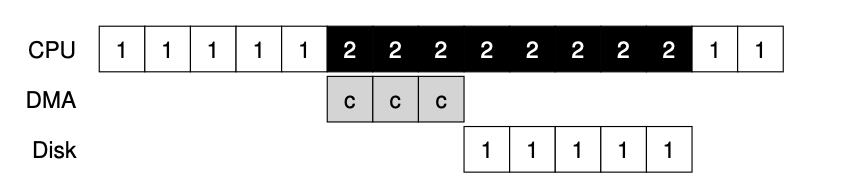

# Disconnected Operation in the Coda File System (1991)  

Link: [Coda File System](https://www.cs.cmu.edu/afs/cs/project/coda-www/ResearchWebPages/docdir/s13.pdf)

Read June 25th, 2024.

This paper presents Coda File System, based AFS. It was designed for mobile clients that disconnect as their machines move. 

To make disconnected operation transparent, each client keep a cached copy of remote files once connecting to the server. When disconnected, clients can work on the local cached copy without accessing to server. Once connected back to the server, clients synchronize updated contents with the server and download new files to its cache. 

## Key Motivation: Availability 
Coda wants to support **disconnected operation**, i.e. enables a client to continue accessing critical data during temporary failures. Availability is achieved by replication and disconnected operation with cache

caching can be used to improve both performance and availability. 

Venus is the cache manager.
The set of replication sites for a volume is its volume storage group (VSG). The subset of a VSG that is currently accessible is a client’s accessible VSG (AVSG).

While disconnected, Venus services file system requests by relying solely on the contents of its cache. Cache misses are appeared as failures.

-   **Server replication** for performance, scalability, and availability
    -  consistency ensured by callbacks  
-   **Client replication** for (more) availability
    -  client continues to work from local cache when disconnected 
-   **Optimistic replica control** to make it all work
    -  allow copies to diverge, detect, and resolve conflicts 
-  

For scalability, it uses **callback-based cache coherence**, and **whole-file caching**; as well as placing of functionalities on clients.

### Design Goal

Availability is the major concern

- Want to support **disconnected operation**
- i.e. enables a client to continue accessing critical data during temporary failures
- **Key idea:** availability by replication and disconnected operation with cache

### Design Rationale

- **Replicate across servers** for performance, scalability, and availability
    - Servers have higher quality (space, security, maintenance)
- **Replicate across clients** for (more) availability
    - Continue to work across failures and intentional disconnection
    - But do not trust results of disconnected operation
- Use **optimistic replica control** to make it all work
    - Locks and leases are too limiting
        - Locks: reserve resources for too long
        - Leases: reserve resources for not long enough
          - Placing a time bound on exclusive or shared control, as done in the case of leases [7], avoids this problem but introduces others. Once a lease expires, a disconnected client loses the ability to access a cached object, even if no one else in the system is interested in it. This, in turn, defeats the purpose of disconnected operation which is to provide high availability. Worse, updates already made while disconnected have to be discarded.
    - Optimistic control may result in (W/W) conflict
        - Need conflict detection and resolution, but uncommon for UNIX env
    - UNIX write sharing is uncommon. Consistent with the goal of maximizing availability.

### Architecture

- The architecture is almost the same as AFS
    - Place functionality on clients for scalability (e.x. callbacks, whole-file caching, name resolution, …)

- ***HOARDING:*** Pre-caching for disconnected information access
    - Client is connected and actively downloaded files from server and keep a cache locally
    - Balance current working set v.s. future needs
        - Hoarding DB (HDB) provides user-specified list of files
            - Prioritized, may include directories and their descendants
        - Cache organized hierarchically
            - I.e. ancestors of a cached object must be cached
        - Hoard walking: maintains equilibrium
            - Goal: no uncached object has higher priority than cached ones
            - Operation
                - Phase 1: Re-evaluate name bindings to identify all children (i.e. any new children created by other clients?)
                - Phase 2: Re-calculate priorities in cache and HDB, evict and fetch as needed
    - Callbacks during Hoarding
        - Purge files, symlinks immediately
        - Delay directory operations

- ***EMULATION:** Psuedo-server*
    - Client disconnects but acts like it is connected by working on the cached contents
        - Modified objects assume infinite priority
          - So they are not purged before reintegration.
        - Log operations for later REINTEGRATION
            - Replay log (metadata, HDB) accessed through recoverable virtual memory (RVM)
            - Contains store operations, but not individual writes
            - Removes previous store records on repeated close
            - Should remove stores after unlink or truncate
            - Should remove log records that are inverted
            - Cacnellation of old log records (e.g. `rmdir`)
- ***REINTEGRATION***
    - Perform a volume at a time, where the operations to a volume is suspended. 
    - Propagates changes back to servers (i.e. transfer updates, resolves conflicts)
        - Changes at one end: updates
        - Changes in both end: W/W conflict
    - Ship log to all servers in AVSG
        - Begin transaction, lock all referenced objects
        - Validate each operation and then execute
        - Perform data transfer (back-fetching)
        - Commit transaction, unlock all objects
        - On error, abort and create replay file
      - 
## Disconnected operations: state transition 
* **Hoarding**: pre-caching 
  * client is connected and actively downloaded files from server and keep a cache locally 
  * balance current working set v.s. future needs  
  * hoard walk periodically restores equillibrium between recent and explicit cache
    * Some cached file prioirty is lower than the uncached files' priority.
  * refetch purged cache object upon next hoard walk
  * directories allowed to become inconsistent as most operations are adding or removing items
  * Implicit information (recent reference history); Explicit information (per-work station user profiles.)
  * Hoard priority
  
* **Emulation**: psuedo-server 
  * replace the function of the server
  * logging for fault-tolerance
    * save replay log locally
    * compact entries to log to limit cache growth
  * RVM (camelot) keeps integrity of metadata during disconnected operation
* **Reintegration**
  * propagates changes back to servers (i.e. transfer updates, resolves conflicts) 
  * on conflicts, users use a debugging program to replay selectively
    
## Optimistic v.s pessmistic replica control 
1. Pessimistic 
    1. Only one partition is allowed to access files during network partition
    2. Pros: always consistent
    3. Cons: unavailability
        1. Difficult to handle involuntary disconnection (i.e. if it held a lock) 
        2. Errant client can block other client indefinitely
2. Optimistic 
    1. All partitions can access files 
    2. Conflicts are detected and resolved later
    3. Pros: high availability
    4. Cons: conflicting writes, relies on resolution protocol  
    5. Rational of using this: chance of conflicts is low because **low degree of write share in UNIX**
