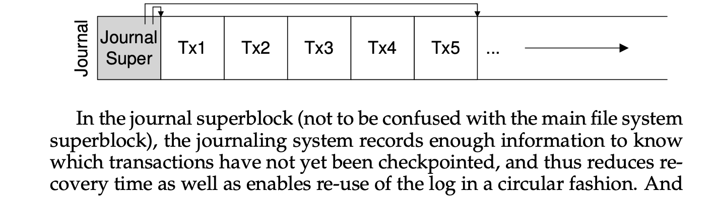
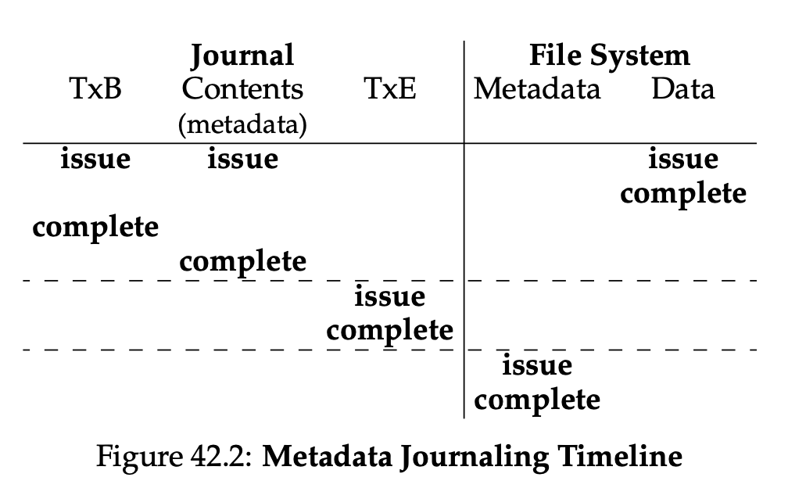

# Crash Consistency: FSCK and Journaling 

## Example: append

- Append operation
    - Open the file
    - `lseek()` to move the file offset to end of the file
    - Issue a 4KB write to the file before closing it
    - This needs to update
        - The inode (which must point to new block and record the new larger size due to append)
        - The new data block
        - A new version of the data bitmap
    - These dirty writes still sit in main memory (in the **page cache** or **buffer cache**) for some times
    - Buffers are associated with a specific block device, and cover caching of filesystem metadata as well as tracking in-flight pages. The cache only contains parked file data. That is, the buffers remember what's in directories, what file permissions are, and keep track of what memory is being written from or read to for a particular block device. The cache only contains the contents of the files themselves.
    - Buffer cache and page cache are unified later in Linux. 

### One single write succeeds

1. Just the **data block (Db)** is written to disk
    1. Just data is on disk, no inode points to it, no bitmap says the block is allocated 
    2. As if the write never occurs, no problem at all from FS crash consistency point! 
2. Just the **updated inode** is written to disk
    1. We will read garbage data from the disk! 
    2. New problem: **FS inconsistency** 
        1. On-disk bitmap is telling us that data block has not been allocated, but inode saying that it has 
3. Just the **updated bitmap** is written to disk 
    1. File system is inconsistent again 
    2. Bitmap indicate that the block is allocated, but no inode points to it 
    3. This write will result in **space leak**, as block 5 would never be used by FS
4. 

### Two writes succeed

- Inode and bitmap succeed, not data
    - 5 has garbage
- Inode and data block succeed, not the bitmap
    - Inconsistency between inode and old version of the bitmap
- Bitmap and data block written, not the inode
    - No idea which file the block belongs to

## The Crash Consistency Problem

What we’d like to do ideally is move the file system from one consistent state (e.g., before the file got appended to) to another **atomically** (e.g., after the inode, bitmap, and new data block have been written to disk). 

Unfortunately, we can’t do this easily because the disk only commits one write at a time, and crashes or power loss may occur between these updates. We call this problem crash-**consistency problem** (i.e. **consistent update problem**).

### Solution #1: File System Checker (FSCK)

- Basic idea: let inconsistency happen, fix them later
- FSCK: a UNIX tool to check and repair a disk partition exist on different systems
    - Runs before the file system is mounted and made available
    - Once finished, should be consistent and made accessible
- Summary
    - Superblock: sanity check (i.e. FS size > # of blocks allocated)
    - Free blocks: scan inodes, indirect blocks, to understand which blocks are currently allocated within FS. Inconsistency between bitmaps and inodes are resolved by trusting inodes.
    - Inode state: checked for corruption, check valid type field
    - Inode links: scan through directory tree, build link counts for every file, if mismatch between new calculated count and inode, correct action by fixing count within inode
    - Duplicates: two inodes point to the same block
    - Bad blocks: if pointer points to something outside valid range (i.e. refer to block greater than partition size)
    - Directory checks: integrity check to make sure “.” and “..” are first entries, etc.
- Problem
    - Complicated knowledge about FS
    - Way too slow!!
        - search-the-entire-house-for-keys recovery algorithm

### Solution #2: Journaling (write-ahead logging)

- Linux ext3, ext4, IBM’s JFS, CFS, Windows NTFS
- Basic idea: when updating the disk, before overwriting structures in place, first write down a little note (i.e. log) describing what you are about to do
    - Idea is to go back and look at the node you made and try again

### 2.1 Data Journaling (i.e. in Linux ext3) 

- The transaction begin (TxB)
- some kind of transaction identifier (TID).
- The final block (TxE) is a marker of the end of this transac- tion, and will also contain the TID.
-  The mid- dle three blocks just contain the exact contents of the blocks themselves; this is known as physical logging as we are putting the exact physical contents of the update in the journal (an alternate idea, logical logging, puts a more compact logical representation of the update in the journal, e.g., “this update wishes to append data block Db to file X”
  
1. **Journal write**: write the transaction, including a transaction begin block, all pending data and metadata updates, and a transaction end bloc, to the log; wait for these writes to complete
    1. What if writing to journal files? 
        1. Issue each one at a time: slow! 
        2. Issue five at a time: non-correct
    2. Solution: issue transactional write in two steps (atomicity guarantee provided by disk)
        1. Write all blocks except the TxE block to the journal, issuing these writes all at once
        2. When these writes complete, issue write of TxE block, leaving journal in this final, safe state
2. **Checkpoint**: write the pending metadata and data updates to their final locations in the file system 
   1. I.e. bring it up-to-date with the pending update in journal 

Updated step:

1. **Journal write:** Write the contents of the transaction (including TxB, metadata, and data) to the log; wait for these writes to complete.
2. **Journal commit:** Write the transaction commit block (containing TxE) to the log; wait for write to complete; transaction is said to be **committed**.
3. **Checkpoint:** Write the contents of the update (metadata and data) to their final on-disk locations.

### 2.2 Recovery

- Main thing: use contents of journal to **recover** from a crash
- Steps
    - Before journal write: pending update is simply skipped
    - After commit, before checkpoint completes: recover update by replay the log (i.e. **redo logging**)
        - Might have redundant writes, but okay!

### 2.3 Batching log updates

- Buffer all updates in a global transaction
- E.g. Write two files in the same directory. 
- Avoid excessive write traffic

### 2.4 Making the log finite

- Log may become full
    - Larger log, longer recovery
    - When log is full, no further transactions can be committed to disk, making FS useless
- JFS: treat log as a circular data structure (i.e. circular log)
    - Journal superblock: record enough information to know which transactions have not yet been checkpoint, thus reduce recovery time and enable re-use of log in circular fashion
- 

### 2.5 Metadata (Ordered) Journalling

- Problem behind **data** journaling is that we are writing data to disk twice, which is a heavy price to pay. 
- More popular than data journaling, e.x. NTFS, XFS
- User data is not written to the journal!
1. Write Db to disk after transaction completes? 
    1. File system is consistent but may end up pointing to garbage data
    2. E.x. Db did not make it to disk; recover only produce a consistent FS
2. Write data blocks to disk first (i.e. Linux ext3)
    1. **Data write:** Write data to final location; wait for completion (the wait is optional; see below for details).
        1. Forcing data write to complete is not required for correctness 
        2. It will be fine to concurrently issue writes to data, the transaction begin log and journaled metadata 
        3. The real requirement: step 1 and 2 complete before issuing journal commit 
    2. **Journal metadata write:** Write the begin block and metadata to the log; wait for writes to complete.
    3. **Journal commit:** Write the transaction commit block (containing TxE) to the log; wait for the write to complete; the transaction (including data) is now committed.
    4. **Checkpoint metadata:** Write the contents of the metadata update to their final locations within the file system.
    5. **Free:** Later, mark the transaction free in journal superblock.

Important: rule of “write the pointed-to object before the object that points to it” is at core of crash consistency 

### 2.6 Tricky Case: Block Reuse 
- Create, delete, and create the same file reusing the same block, the newly-written data in block 1000 is not journaled
- Crash occurs, with this log, reply
    - Write of directory data in block 1000, overwrite user data with old directory contents!
- Solution: **revoke**
    - Deleting the directory would cause a revoke record to be written to the journal
    - When replaying the journal, the system first scans for such revoke records
    - Any such revoked data is never replayed, thus avoiding the problem mentioned above

(Data Journaling)

(Metadata Journaling)
## Solution #3: other approaches

1. Software updates 
    1. Carefully orders all writes to the FS to ensure that on-disk structures are never left in an inconsistent state 
    2. Requires intricate knowledge of each file system data structure and add complexity to the system 
2. **Copy-on-write (COW), like LFS** 
    1. Technique: never overwrite files or directories in place 
    2. Instead: places new updates to previous unused locations on disk 
    3. After a number of updates completed, COW file system flips the root structure of the file system to include pointers to newly updated structures 
3. **Backpointer-based consistency (BBC)**
    1. No ordering is enforced between writes
    2. Back pointer is added to every block in the system 
    3. Determine consistency by checking if the forward pointer points to a block that refers back to it 
4. **Optimistic crash consistency** 
    1. Issues as many writes to disk as possible by using a generalized form of **transaction checksum**