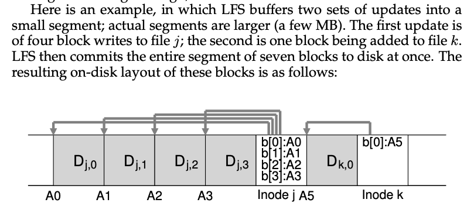
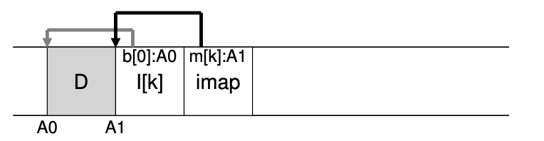
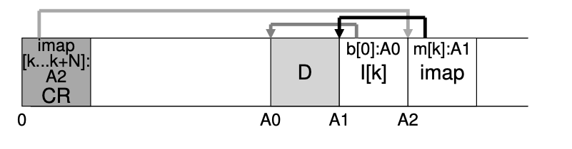
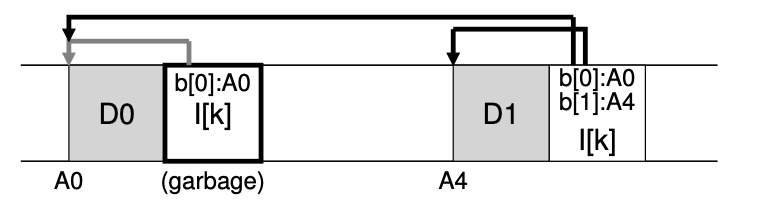

# Log File System (LFS)

## Summary

- LFS introduces a new approach of writing to disk
- Instead of overwriting files in place, write to an unused portion of the disk, later reclaims that old space through cleaning
- In DB this is called: **shadow paging**, and in FS it is called **copy-on-write**
    - Copy-on-wrtie: duplicate data only when changes are made
    - The old data isn't immediately "erased" but is instead "shadowed" by the new data until the space is reclaimed
    - Enables highly efficient writing
    - Gather all updates into an in-memory segment and write them out together sequentially

## Motivation

- **System memories are growing**
    - More data can be cached in memory
    - More writes, FS performance is largely determined by write performance
- **Large gap between random I/O and sequential I/O performance**
  - Sequential I/O is decreasing much slower. 
- **Existing FS perform poorly on many common workloads**
    - E.x. FFS perform many writes to create a new file of size one block
- **File systems are not RAID-aware**
    - RAID-4 and RAID-5 have small-write problem (i.e. one logical write causes 4 physical I/O)

Thus we want to build an FS that focus on write performance, and try to make use of the sequential bandwidth of the disk.

## LFS

When write to disk, first buffer all updates (including metadata) in a memory segment; when the segment is full, it is written to disk in one long, sequential transfer to an unused part of the disk. LFS never overwrites data, but rather always write segments to free locations.

- When user writes a data block, write data, and the metadata (i.e. Inode) to the disk
- Data block ~4KB, inode ~128 bytes

### 1.2 Writing sequentially and effectively

- Writing to disk sequentially is not enough to guarantee efficient writes
- LFS uses **write buffering**
    - Keeps track of updates in memory before writing to disk
    - Write to disk all at once
    - Unit of buffering: **segment**
      - The large chunk of updates LFS writes at one time is referred to by the name of a segment.

### 1.3 How much to buffer?

This depends on the disk. 

- Every time you write, you pay a fixed overhead of the positioning cost
- How much do you have to write in order to amortize the cost?

$$
D = \frac{F}{1-F}\times R_{\text{peak}} \times T_{\text{position}}
$$

- $F:$  some fraction of the peak rate
- $R_{\text{peak}}:$  the disk transfer rate
- $T_{\text{position}}:$ positioning (i.e., rotation and seek overheads) time

### 1.4 Inode map

Problem: finding inode is hard in LFS 

- FFS finding inode: easy, organized, put at fixed location
- LFS: scatter the inodes all throughout the disk! Worse, we never overwrite in place, and thus the latest version of an inode (i.e., the one we want) keeps moving.

Solution: inode map 

- Inode map: takes an inode number as input and produce disk address of most recent address of the inode
- Inode map: persistent
    - Keep track of locations of inodes across crashes
    - Chunks of inode map is placed right next to where it is writing all of the other new information

Unfortunately, as it gets updated frequently, this would then require updates to file structures to be followed by writes to the imap, and hence performance would suffer (i.e., there would be more disk seeks, between each update and the fixed location of the imap).

`imap` is placed close to the inode. In this picture, the piece of the imap array stored in the block marked imap tells LFS that the inode k is at disk address A1; this inode, in turn, tells LFS that its data block D is at address A0.

### 1.5 Checkpoint Region

- FS have fixed and known location on disk to begin file lookup: **checkpoint region (CR)**
- Contains pointers to the latest pieces of the inode map
- Updated periodically (~30s) or so

- LFS should perform the same amount of I/O as a typical file system during read
- The entire imap is cached so extra work is just look up the inode’s address in the imap
- Thus, the overall structure of the on-disk layout contains a checkpoint region (which points to the latest pieces of the in- ode map); the inode map pieces each contain addresses of the inodes; the inodes point to files (and directories) just like typical UNIX file systems.
- Inode map contains the information for the location of both the directory file *dir* as well as the newly created file *f*

### 1.6 Directories

- LFS also solve a problem: recursive update
    - Problem arises to any FS that never updates in place, but rather move updates to new locations on the disk
    - When an inode is updated, its location on disk changes (need to update way up to the file system tree)
    - With inode map, even though the location of inode might change, the change is never reflected on the directory itself
    - The imap is updated while the directory hold the same name to inode number mappings

Solution 1: versioning 

- Keep older versions and allow users to restore old file system

Solution 2: garbage collection 

- Imagine we append D1 to the original file k.
- In this case, a new version of the inode is generated, but the old data block is still pointed to by the inode. 
  - 
- LFS instead keeps only the latest live version of a file
- Cleaner works on a segment-by-segment basis
    - How it works
        - Periodically, LFS cleaner reads in a number of old (partially-used) segments
        - Determines which blocks are live within these segments
        - Write out a new set of segments with just the live blocks within them
        - Freeing up old ones for writing
    - I.e. reading in M existing segments, **compact** their contents into N new segments (N < M)
- Mechanism: how to determine block liveness?
    - Maintain **segment summary block**
    - Information, for each data block D, its inode number (which file it belongs to) and its offset (which block of the file)
      - This information is recorded in a structure at the head of the segment known as the segment summary block.
    - How it works
        - For block D located at disk address A
        - Look into segment summary block and find its inode number N and offset T
        - Look in imap to find where N lives and read N from disk
        - Using offset T, look in the inode, see where the inode thinks it is on the disk
        - If the pointer is at address A, then live; otherwise, dead
- Policy: how often should the cleaner run, and which segments to pick to clean?
    - Original LFS paper: segregate hot and cold segments
    - Hot: contents being frequently updated
    - Cold: few dead blocks, but rest of the contents are stable
    - Policy: clean cold segments sooner and hot segments later
        - Write cost = average amount of time the disk is busy per byte of new data written, including all the cleaning overheads
        - Write cost = total amount of bytes moved to and from disk divided by # of those bytes represent new data
            - Utilization of segments = u (0 < u < 1)
            - Write cost = $\frac{2}{1-u}$

### 1.8 Crash Recoveries

- What happens if the system crashes while LFS is writing to disk?
- LFS organizes these writes in a **log**
    - CR points to a head and tail segment, each segment points to the next segment to be written
    - Periodically update the CR
- What happens
    - **Writing to the CR fails**
        - LFS keeps two CRs, one at either end of the disk, and write to them alternately
        - Implements a protocol when updating the CR with the latest pointers to the inode map and other information
            - First writes out a header (Timestamp)
            - Then the body of the CR
            - Then finally one last block (Timestamp)
            - If crashes, see inconsistent timestamps
 - **Writing to a segment fails**
    - Write CR every 30s or so, so last consistent snapshot of FS may be quite old
    - Upon reboot, recover by reading in CR, but it is possible many seconds of updates would lost
    - Solution: **roll forward**
        - Start with the last checkpoint region
        - Find the end of the log (which is included in the CR)
        - Use that to read through the next segments and see if there are any valid updates within it
        - If so, updates the FS accordingly and recovers much of the data and metadata written in the last checkpoint

### Performance

- Excellent performance on many different devices
    - Hard drives: position time is minimized
    - Parity-based RAIDs (-4, and -5), avoid small write problem entirely
    - Flash-based SSDs
    - …
- Downside: generate garbage
    - Cleaning is hard, cleaning cost is a concern
- Some modern commercial FS: NetApp’s WAFL, Sun’s ZFS, Linux btrfs, flash-based SSDs
    - Adopt similar copy-on-write approach
    - WAFL gets around cleaning problem by turning them into feature: snapshots!

