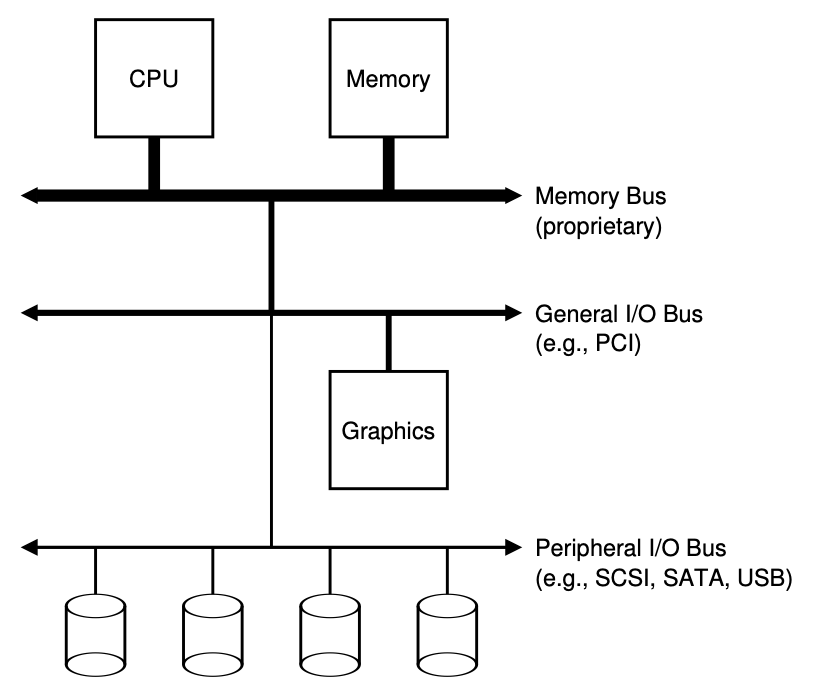
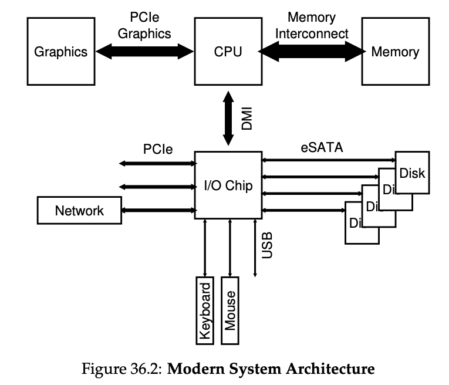
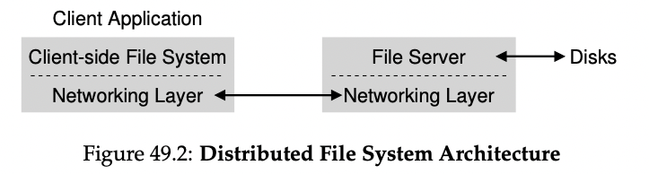

# Design and Implementation of the Sun Network Filesystem (NFS) (1985) 

Link: https://www.cs.ucf.edu/~eurip/papers/sandbergnfs.pdf

Read: June 25th, 2024.

NFS is a **distributed file system** designed to make sharing of filesystem resources in a network of non-homogeneous machines easier. Design goals are 

- Client-side FS: issue system calls, wants to have transparent access to files
- Server-side FS: reply to client request
- Benefits
    - Easy sharing of data across clients
    - Centralized administration (e.x. backing up files)
    - Security (e.x. secure servers)

1. **Crash recovery** (main goal): recover easily from server crashes
2. Transparency and UNIX semantics: access remote files as local 
3. **Reasonable performance**
4. Machine & os independence: being able to supply files to different types of clients 

## Techniques 
There are a few techniques used to achieve these goals 

### 1. Simple and fast recovery: _statelessness_
*  Stateless protocol: server does not keep track of anything about client
    *  most requests are **idempotent** (e.x. `LOOKUP`, `READ`, `WRITE`)   
*  Key structure: file handle (FD)
    *  <volume id, inode id, generation #>     
    *  - *Volume identifier* —> which FS the request refers to
       - NFS server can export more than one FS
   - *Inode identifier* —> which file within that partition the request is accessing
   - *Generation number* —> needed when reusing an inode number
       - Increment it whenever an inode number is reused
       - Ensure that a client with an old file handle can’t accidentally access the newly allocated file
*  Steps 
    *  every client RCP call pass a FD
    *  server fails: client retires
*  - Stateful protocol
    - Shared / distributed state complicates crash recovery
    - Server maintain a file descriptor to actual file relationship

### 2. Transparency: mounting
*  use `MOUNT` to attach a remote file system to a directory
*  Hostname lookup and address binding once per FS

### 3. Performance: caching 
#### 1) Client: R/W (cache consistency problem) 
   * _update visibility_: when do updates from client visible to others
       *  Sol: flush-on-close 
   * _stale cache_: server newer copy visible to other clients
       *  Sol: cache invalidation via `GETATTR` requests, with metadata cache

1. Two-fold 
    1. Cache file data (metadata) that it has read from server in client memory
    2. Cache as a temporary buffer for writes 
2. Problems in cache consistency 
    1. *Update visibility* - when do updates from one client become visible at other clients?
    2. *Stale cache* - once the server has a newer version, when do the clients become visible to this version over the old cache copy?

#### 2) Server: buffer writes 
* Performance v.s durability: if server crash
    *  put in battery-backed mem, or use faster medium to write
 
 
### 4. Machine & OS independences: VFS / Vnode interface 
- *Virtual File System (VFS)*: includes operations that are done to the entire file system
    - E.x. mounting, unmounting, getting FS-wide statistics, forcing dirty writes to disk, etc.
- *Virtual node (Vnode)*: includes all operations one can perform on a file
    - E.x. open, close, reads, writes, etc.
- - To build a new FS, one just needs to define these “methods”
- The framework will handle the rest
    - connecting sys calls to particular FS implementations
    - performing generic functions common to all FS (e.g. caching) in a centralized manner
    - and thus enabling multiple FS implementations to coexist in the same OS
 
## Problem 
Security in early NFS implementation was lax: easy for any user on a client to masquerade as other users and gain access to virtually any file 
Performance: though with caching, still a bunch of issues 

# Sun’s Network File System (NFS)

## A Basic Distributed File System 

- Client: client-side file system
    - A client application issues system calls to the client-side FS (i.e. `open()`, `read()`, `write()`, `close()`, `mkdir()`)
    - Transparent access to files
- Server: server-side file system (or the file server)
    - Reply to client request

## Intro

- One of the earliest and quite successful distributed systems
- Sun Microsystems developed an open protocol which specified the exact message formats that clients and servers use to communicate

Sun NFS instead developed an open protocol which simply specified the exact message formats that clients and servers would use to communicate.

## Focus: simple and fast server crash recovery 

Key to fast crash recovery: statelessness 

- Server does not keep track of anything about what is happening at each client
    - I.e. which clients are caching which blocks, which files are currently open at each client, file pointer position, etc.
- V.s. a stateful protocol
    - E.x. `open()` call from client side, return descriptor; the server fails and client issues subsequent read
    - File descriptor: **shared state** or **distributed state** between the client and the server
    - **Recover protocol**: client would make sure to keep enough information around to tell server what it needs to know
    - Get worse if the stateful server has to deal with client crashes (e.x. open and fail, when to close?)

- Now imagine that the client-side file system opens the file by sending a protocol message to the server saying “open the file ’foo’ and give me back a descriptor”. The file server then opens the file locally on its side and sends the descriptor back to the client. On subsequent reads, the client application uses that descriptor to call the read() system call; the client-side file system then passes the descriptor in a message to the file server, saying “read some bytes from the file that is referred to by the
descriptor I am passing you here”
- n this example, the file descriptor is a piece of shared state between
the client and the server (Ousterhout calls this distributed state [O91]).
It gets even worse when you consider the fact that a stateful server has to deal with client crashes. Imagine, for example, a client that opens a file and then crashes. The open() uses up a file descriptor on the server; how can the server know it is OK to close a given file? In normal operation, a client would eventually call close() and thus inform the server that the file should be closed. However, when a client crashes, the server never receives a close(), and thus has to notice the client has crashed in order to close the file.

### NFSv2 Protocol

- Crux: how to define the protocol to be both stateless and support POSIX file system API?
- File handle
    - *Volume identifier* —> which FS the request refers to
        - NFS server can export more than one FS
    - *Inode identifier* —> which file within that partition the request is accessing
    - *Generation number* —> needed when reusing an inode number
        - Increment it whenever an inode number is reused
        - Ensure that a client with an old file handle can’t accidentally access the newly allocated file

- `LOOKUP`
    - Used to obtain a file handle
    - Input: directory file handle and name of a file to look up
    - Output: file handle (or directory) plus its attribute
    - E.x. assume client already has file handle for root dir (`/`) (with **mount protocol**)
    - Second, you may notice where server interactions occur. When the file is opened for the first time, the client-side file system sends a LOOKUP request message. Indeed, if a long pathname must be traversed (e.g., /home/remzi/foo.txt), the client would send three LOOKUPs: one to look up home in the directory /, one to look up remzi in home, and finally one to look up foo.txt in remzi.
    Third, you may notice how each server request has all the information needed to complete the request in its entirety. This design point is critical to be able to gracefully recover from server failure, as we will now discuss in more detail; it ensures that the server does not need state to be able to respond to the request.
- `READ`
    - Input: file handle of the file, along with offset within the file and # of bytes to read
    - `WRITE` is handled similarly
- `GETATTR`
    - Given a file handle, it simply fetches the attributes of that file, including the last modified time
    - Important for caching

### From Protocol to Distributed File System 

- Client-side FS: tracks open files, and generally translate requests into set of protocol messages
- Server: simply responds

### Aside note

1. Idempotency is powerful! 
    - When an operation can be issued more than once, it is much easier to handle failure of the operation, you can just retry it
2. Perfect is the enemy of the good (Voltaire’s Law) 
    1. Corner cases: e.x. `MKDIR`
    2. Accepting life isn’t perfect and still building the system is a sign of good engineering 
3. Design for common case, and to make it work well

### Handling server failure with idempotent operations

- Server can fail to reply
    - 1) request lost
    - 2) server down
    - 3) reply lost on the way back from server
- Approach: client simply retries the request
- Property: most NFS requests are **idempotent**
    - **Def:** when the effect of performing the operation multiple times is equivalent to the effect of performing the operation a single time
    - E.x. `LOOKUP` and `READ`
    - E.x. `WRITE`
        - If, for example, a WRITE fails, the client can simply retry it. The WRITE message contains the data, the count, and (importantly) the exact offset to write the data to.
        - Thus, it can be repeated with the knowledge that the outcome of multiple writes is the same as the outcome of a single one
    - Some operations are hard to make idempotent
        - E.x. `MKDIR`

### Improving performance: client-side caching

- NFS client-side FS caches file data (and metadata) that it has read from the server in client memory
    - First access expensive, consecutive one fast
    - Cache: temporary buffer for writes
- **Cache consistency problem**
    - P1: update visibility - when do updates from one client become visible at other clients?
        - NFSv2 clients implement **flush-on-close** (a.k.a., **close-to-open**) consistency semantics
        - When a file is written to and subsequently closed by a client application, the client flushes all updates (i.e. dirty pages in the cache) to the server
        - This ensures that a subsequent open from another node will see the latest file version
        - Problem: temporary file soon being deleted
    - P2: stale cache - e.x. C1
        - NFSv2 client first check to see whether a file has changed before using its cached contents with `GETATTR` request
        - If out-dated, then client **invalidates** the file and removing it from client cache
        - Problem: flooded with `GETATTR` request
        - Remedy: attribute cache was added to each client; attribute for a particular file were placed in cache when file was first accessed, then would timeout
            - But hard to understand or reason about what exact version of file one was getting
        - Attribute cache has low TTL. 

### Implication on server-side write buffering

- If NFS servers may NOT return success on a WRITE protocol request until the write has been forced to stable storage
    - This might cause problem if the server crash
- If NFS commit each write to stable storage before informing success
    - Write performance can be bottleneck
    - Some tricks
        - First put writes in a battery-backed memory
        - Second is to use a FS specifically designed to write to disk quickly