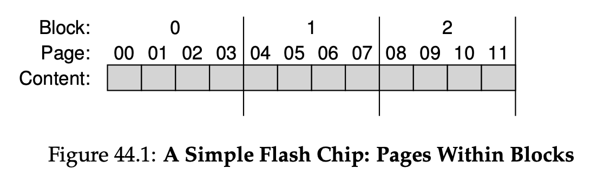
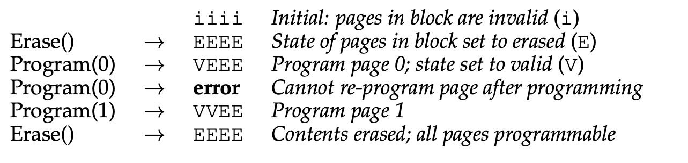
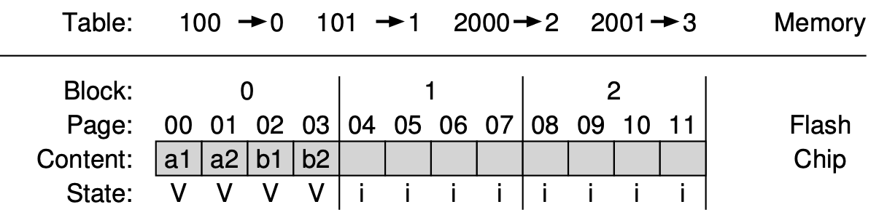
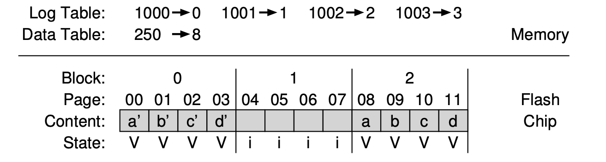

# Storage Systems
- Physical organization and performance of Hard Disk Drives (HDDs) and Solid State Drives (SSDs)
- File system structure: directory structure, index structure (inodes), storage blocks, free space map, hard links, soft links, and buffer cache
- Case studies: File Allocation Table (FAT) and Berkeley Fast File System (FFS)
- Replication as a means for durability: erasure codes and RAID (disk replication)
- Transactions as a means for reliability: journaling file systems and redo logging

## Concepts explain

### HDDs

- Disk has a sector-addressable address space
    - Array of sectors, each typically 512 bytes (i.e. blocks)
    - Main operations: reads and writes to sectors
- Basic geometry
    - Platter: circular hard surface on which data is stored persistently by including magnetic change to it
        - 2 sides: each side is a surface
    - Spindle: platters bound together around spindle (i.e. rotations)
    - Track: data encoded on each surface in concentric circles of sectors, one circle is a track
    - Disk head (perform read and write) attached to a single disk arm
- Performance
    - Read / write time = seek time (multiple track) + rotation (single track latency) + transfer time
    - Mechanical and slow

### SSDs

- Basics
    - A **flash chip** consists of many banks, each of which is organized into **blocks**
    - Each blocks is further subdivided into some number of **pages**
    - Blocks are large (128KB - 2MB) and contain many pages of small size (1-8KB)
- **Organizations**
    - Some number of flash chips (for persistent storage)
        - Use multiple flash chips in parallel, reduce write amplifications
    - Some amount of volatile (i.e. non-persistent) memory (e.g. SRAM)  for caching
    - Control logic to orchestrate device operation: FTL
        - Transform reads and writes from a client into reads, erases, and programs to underlying flash chips
- R/W
    - Read: issue read with an address and length
    - Write: client erase the entire block (which delete information within the block), then client can program each page exactly once
- **Performance**
    - Read
        - ~10ms, regardless of location of device, super good read performance (i.e. random access device)
    - Write
        - Erase is expensive
- **Reliability**
    - Primary concern: wear out
        - Explain: if a block is erased and programmed too often, it becomes unusable
        - Sol: *wear leveling*
            - FTL should try its best to spread that work across all the blocks of the device evenly
            - Sol: Log-structured FTL
                - Spread out the write load (v.s. overwriting the same block)
                - Garbage collection helps as well
                    - I.e. finding a block that contains garbage pages, read in live pages, write out those to log, reclaim entire block in writing
    - Another issue: *disturbance*
        - When accessing a particular page, it is possible that some bits get flipped
        - Sol: program pages within an erased block in order, from low page to high page

### SSD v.s. HDD comparisons

- Performance
    - Much better in **random reads and random writes** than HDD
    - **Sequential performance is less of a different**
    - SSD random read not as good as random write
        - Why unexpectedly good random write performance?
            - Due to log-structured design of many SSDs, which transform random writes into sequential ones to improve performance
    - **Still gaps in sequential and random access performance**
- Cost: per unit of capacity
    - Prevent usage of SSD
    - SSD: $150 for a 250GB drive, 60 cents per GB
    - HDD: $50 for 1TB, 5 cents per GB

## File System Structure

- **File:** an array of bytes which can be created, read, written, and deleted
    - It has a low-level name (i.e. a number) that refers to it uniquely
    - The low-level name is often called an i-number
- **Directory:** a collection of tuples, each of which contains a human-readable name and low-level name in which it maps
    - Each entry refers to either another directory or to a file
    - Each directory has a low-level name (i-number) itself
    - Always have two special entries: `.` and `..`
- **Inode:** index node
    - Structure that holds the metadata for a given file (i.e. length, permissions, locations of its blocks)
- **Storage blocks**
    - Data structure of the file system to organize data and metadata
    - Arrays of blocks
    - Block: commonly 4KB
    - FS organization
        - Data region: region of disk used for user data
        - Metadata: keep track of information about each file
        - Allocation structure: whether inodes or data blocks are freed or allocated
        - Superblock: contain information about a specific fs
- **Free space management**
    - The system must track which inodes and data blocks are free s.t. when new file / directory is created, it is able to find space for it
    - Two bit maps
        - Inode bitmap: find an inode that is free, allocate it to a file, marked it as used
        - Data bitmap: find data block that is free, allocate it
- **Links**
    - **Hard link:** create another name in the directory you are creating the link to, and refer it to the same inode number (i.e. low-level name) of the original file
        - Data is not copied, just two names
        - Use reference counting: inode maintains counter that allow FS to check how many different file names have been linked to the nodes
        - Pros
            - Can’t create one to directory (i.e. fear of cycle in directory tree)
            - Can’t hard link to files in other disk partitions (i.e. inode number only unique within a single FS)
    - **Symbolic link:** actually is a file itself that point to another file by name
        - I.e. holding the pathname of the linked-to file as the data of the link file
        - Removing the original file causes the link to point to a pathname that no longer exists: dangling pointers
- **Buffer cache**
    - Or page cache
    - Refer to an area of main memory (RAM) that temporarily holds copies of disk blocks (data blocks, inodes, imaps, etc.)
    - The use of a cache aims to reduce the # of slow disk I/O operations by keeping frequently accessed or recently used data in faster, but more limited, main memory

## Case Study

### File Allocation Table (FAT)

- **How to design an inodes to point to data blocks?**
- Baseline: use linked list
    - One pointer, points to the first block of the file, and add another pointer at the end of that data block, etc. to support large files
    - Poor performance: random access, or access offset of the file, etc.
- File Allocation Table
    - In-memory table of link information instead of storing next pointers with the data blocks
    - Indexed by address of data block $D$
    - Content of entry: $D$’s next pointer (i.e. the address of next block in file which follows $D$) d
        - Marker to indicate EOF and whether a particular block is free
    - Directory entries
        - No inode per se
        - Directory entries that store metadata about a file and refer directly to the first block of said file
- How does this compare with inode-based structure?
    - In memory mapping then eliminate the need of traversal
    - But not in-memory, then inode-structure has much better random read performance
        - And also inode-structure can have hard links

### Fast File System (FFS)

First disk-aware file systems: 

- Motivation
    - Old UNIX file system structure has bad performance (i.e. data spread all over the place, data blocks away from inode)
    - File system get fragmented, free list ended up pointing to bunch of blocks spread across the disk
    - Original block size too small
- The idea was to design the file system structures and allocation policies to be “disk aware” and thus improve performance
- Organizing structure: cylinder group (i.e. locality groups)
    - Use group across disks
        - Groups are ranges of cylinders
    - Keep related stuff together: allocate inodes and data blocks in the same group
        - File inodes are allocate in the same group with directory
        - Directory inodes are allocated in new group with fewer used inodes than average group
        - First data blocks allocate near inodes
        - Other data blocks allocated near previous blocks
- Usability
    - Long file names
    - Atomic rename
    - Symbolic links

## Replication for Durability: Erasure Codes & RAID

### Erasure Code

- A method used in storage system to improve durability and availability of data
- Erasure coding is a process where a file is broken into multiple fragments, and extra redundant fragments are generated from the original fragments
    - These fragments are then stored across different locations (e.g., disks, servers, etc.)
    - The magic of erasure coding is that you can reconstruct the original file from a subset of its fragments. This means that even if some fragments are lost or corrupted, you can recover the complete file.

### RAID: redundant array of inexpensive disk

- RAID: a faster, larger, and more reliable disk system
    - One logical disk built from many physical disk
    - Workloads: R/W, fail-stop fault model
- RAID-0: striping
    - Optimize for capacity, no redundancy
- RAID-1: mirroring
    - Keep mirrored copies of the data
- RAID-4: use a parity disk
    - Parity: a form of redundancy used to provide fault tolerance; calculated from the actual data block, purpose is to allow reconstruction of missing or corrupted data
    - Small write problem: parity disk is the bottleneck
- RAID-5: rotating parity
    - Random write improves!

## Transactions as a means for reliability: journaling file systems and redo logging

### Journal File Systems

- **Key problem:** how to update the disk despite crashes?
    - The system may crash or lose power between any two writes, the on-disk state may get partially updated
    - Example
        - Append operation
            - Open the file
            - `lseek()` to move the file offset to end of the file
            - Issue a 4KB write to the file before closing it
            - This needs to update
                - The inode (which must point to new block and record the new larger size due to append)
                - The new data block
                - A new version of the data bitmap
    - One single write succeeds
        1. Just the **data block (Db)** is written to disk
            1. Just data is on disk, no inode points to it, no bitmap says the block is allocated 
            2. As if the write never occurs, no problem at all from FS crash consistency point! 
        2. Just the **updated inode** is written to disk
            1. We will read garbage data from the disk! 
            2. New problem: **FS inconsistency** 
                1. On-disk bitmap is telling us that data block has not been allocated, but inode saying that it has 
        3. Just the **updated bitmap** is written to disk 
            1. File system is inconsistent again 
            2. Bitmap indicate that the block is allocated, but no inode points to it 
            3. This write will result in **space leak**, as block 5 would never be used by FS
    - After the crash, the system boots and wishes to mount the FS again
    - Given that crashes can occur at arbitrary points in time, how do we ensure the file system keeps the on-disk image in a reasonable state?
- **Crash consistency** problem
    - What we’d like to do ideally is move the file system from one consistent state (e.g., before the file got appended to) to another **atomically** (e.g., after the inode, bitmap, and new data block have been written to disk).
    - Unfortunately, we can’t do this easily because the disk only commits one write at a time, and crashes or power loss may occur between these updates. We call this problem **crash-consistency problem** (i.e. **consistent update problem**).
- Journal File System
    - Basic idea: when updating the disk, before overwriting structures in place, first write down a little note (i.e. log) describing what you are about to do
    - Steps (data journaling)
        1. **Journal write:** Write the contents of the transaction (including TxB, metadata, and data) to the log; wait for these writes to complete.
        2. **Journal commit:** Write the transaction commit block (containing TxE) to the log; wait for write to complete; transaction is said to be **committed**.
        3. **Checkpoint:** Write the contents of the update (metadata and data) to their final on-disk locations.
    - Steps (metadata journalling)
        1. **Data write:** Write data to final location; wait for completion (the wait is optional; see below for details).
        2. **Journal metadata write:** Write the begin block and metadata to the log; wait for writes to complete.
        3. **Journal commit:** Write the transaction commit block (containing TxE) to the log; wait for the write to complete; the transaction (including data) is now committed.
        4. **Checkpoint metadata:** Write the contents of the metadata update to their final locations within the file system.
        5. **Free:** Later, mark the transaction free in journal superblock.
    - The key about the above steps
        - Forcing data write to complete is not required for correctness
        - It will be fine to concurrently issue writes to data, the transaction begin log and journaled metadata
        - The real requirement: step 1 and 2 complete before issuing journal commit
            - rule of “**write the pointed-to object before the object that points to it**” is at core of crash consistency
    - Recovery
        - After commit, before checkpoint completes: recover update by replay the log (i.e. **redo logging**)
            - It completes transactions that were committed but not yet checkpointed and ignores or rolls back incomplete transactions.

# Hard Disk Drives

### Basic geometry

1. **Platter**: circular hard surface on which data is stored persistently by including magnetic changes to it 
    1. A disk may have one or more platters
    2. Each platter has 2 sides, each of which is called a **surface** 
    3. Made of some hard material (i.e. aluminum), then coated with thin magnetic layer that enables the drive to persistently store bits even when the drive is powered off 
2. **Spindle:** the platters are all bound together around the spindle 
    1. Connect to a motor that spins the platters around (while the drive is powered on) at a fixed rate 
    2. Rate: **rotations per minimute (RPM)** 
    3. Typical value: 7,200 - 14,000 RPM 
    4. 10,000 RPM —> single rotation is 6 ms
3. **Track:** data is encoded on each surface in concentric circles of sectors, one such concentric circle is a track 
    1. Stack of tracks (across platters): cylinder
4. **Disk head:** the process of read and write is accomplished by disk head 
    1. One such head per surface of the drive 
    2. Attached to a single **disk arm**, which moves across the surface to position the head over the desired track

### Simple disk drive

- Single track latency = **rotational delay**
- Multiple track = **seek time**
    - Move the disk arm to the correct track
    - Some phases: acceleration phase (disk arm gets moving), coasting (arm is moving at full speed), deceleration (arm slows down), settling (positioned at the right track)
    - Settling alone can take 0.5-2 ms
    - Entire seeks often takes 4-10 ms
- Data read or written from / to the surface = **transfer time**
    - Pretty fast, depending on RPM and sector density
    - 100+ MB/s is typical for maximum transfer rate
- Time to R/W = seek + rotation + transfer time

### Other improvement

- Track skew: account for rotation and seek happening at the same time
    - Sequential reads across track boundaries
- Zones
    - ZBR (zoned bit recording): more sectors on outer tracks
    - Improve density of the data stored
- Cache
    - Drives may cache both reads and writes (in addition to OS cache)
    - Read? avoid doing disk seek if sector is in cache
    - Write? Ack writes before it is persisted
    - Disks contain internal memory (2-16MB) used as cache
    - Read-ahead: “Track buffer”
        - Read contents of entire track into memory during rotational delay
    - Write caching with volatile memory
        - Immediately reporting: claim written to disk when not
        - Data could be lost on power failure
    - Tagged command queueing
        - Have multiple outstanding requests to disk
        - Disk can reorder (schedule) requests for better performance

### 1) FIFO

First in first out, however seek + rotation overhead can be significant 

### 2) SSTF (Shortest Seek Time First)

Always choose request that requires least seek time (approximate total time with seek time) 

- Greedy algorithm (look for best NEXT decision)
- How to implement in OS?
    - Sort sector numbers
- Disadvantages?
    - Starvation of some sectors far away from the current location

### 3) Elevator (a.k.a. SCAN or C-SCAN)

Sweep back and forth, from one end of disk other, serving requests as pass that cylinder 

- Sorts by cylinder number, ignores rotation delays
- C-SCAN (circular scan): only sweep in one direction
    - A bit more fair to inner and outer tracks, as pure back-and-forth SCAN favors the middle track (i.e. middle track passed twice before coming back to outer track again)
- Also elevator algorithm
    - Elevator: 10 —> 1, somebody got on 3, and press 4, then the elevator will not go up to 4 because it is closer!
- Cons
    - Ignore rotation

### 4) SPTF (Shortest Positioning Time First) or SATF (Shortest Access Time First)

- Greedy algorithm taking into account both seek and rotation costs
- This is typically done inside the disk (OS has no idea about the zone, layout, etc.)

### Other stuff

- Disk scheduler would also perform **I/O merging**
- How long should the system wait before issuing an I/O to disk?
    - **Work-conserving**: immediately issue request to the disk, always try to do work if there’s work to be done
    - **Anticipatory disk scheduling**: wait a bit

### HDDs

- Disk has a sector-addressable address space
    - Array of sectors, each typically 512 bytes (i.e. blocks)
    - Main operations: reads and writes to sectors
- Basic geometry
    - Platter: circular hard surface on which data is stored persistently by including magnetic change to it
        - 2 sides: each side is a surface
    - Spindle: platters bound together around spindle (i.e. rotations)
    - Track: data encoded on each surface in concentric circles of sectors, one circle is a track
    - Disk head (perform read and write) attached to a single disk arm
- Performance
    - Read / write time = seek time (multiple track) + rotation (single track latency) + transfer time
    - Mechanical and slow

### SSDs

- Basics
    - A **flash chip** consists of many banks, each of which is organized into **blocks**
    - Each blocks is further subdivided into some number of **pages**
    - Blocks are large (128KB - 2MB) and contain many pages of small size (1-8KB)
- **Organizations**
    - Some number of flash chips (for persistent storage)
        - Use multiple flash chips in parallel, reduce write amplifications
    - Some amount of volatile (i.e. non-persistent) memory (e.g. SRAM)  for caching
    - Control logic to orchestrate device operation: FTL
        - Transform reads and writes from a client into reads, erases, and programs to underlying flash chips

# Flash-based SSDs 

## What is SSD

- Flash is a technology by which data is stored while SSDs are a storage device. Not all SSDs use flash as their storage medium, but most currently on the market do.
- SSD is **solid-state storage device**
- Such devices have no mechanical or moving parts like hard drives
- They simply built out of transistors, much like memory and processors
- However, unlike typical DRAM, such SSD device retains information despite power lost
- Technology focusing on: **flash** (i.e. **NAND-based flash**), created in 1980s
    - To write a chunk (i.e. a **flash page**), have to erase a bigger chunk (i.e. **flash block**)
    - Writing too often to a page will cause it to **wear out**

## Storing a single bit

- Flash chips are designed to store one or more bits in a single transistor
    - Single-level cell (SLC) flash
    - Multi-level cell (MLC) flash
    - Triple-level cell (TLC) flash
  - In a single-level cell (SLC) flash, only a single bit is stored within a transistor (i.e., 1 or 0); with a multi-level cell (MLC) flash, two bits are encoded into different levels of charge, e.g., 00, 01, 10, and 11 are repre- sented by low, somewhat low, somewhat high, and high levels. There is even triple-level cell (TLC) flash, which encodes 3 bits per cell. 

## From Bits to Banks / Planes

- Flash chips are organized into **banks** or **planes** which consist of a large number of cells
- A bank is accessed with two different sized unit
    - **Blocks** (i.e. erase block)
        - ~128 kB or 256 KB
    - **Pages**
        - Few KB in size
- Within each bank, large # of blocks
- Within each block, large # of pages
- 

## Basic Flash Operations

- `read` (a page)
    - read page from the flash
    - ~10 ms, regardless of location on the device, and previous request location
    - Being able to access any location uniformly —> device is a **random access** device
- `erase` (a block)
    - Before writing a page, need to first erase the entire block
    - Expensive operation, few ms to complete
- `program` (a page)
    - Once a block has been erased, the program command can change some of the 1’s within a page to 0’s, and write the desired contents of a page to the flash
    - Less expensive than erasing a block
    - More costly than reading a page
    - ~100s ms on modern flash chips
- 

## Reliability

- Flash chips are pure silicon and have fewer reliability issues to worry about
- Primary concern: **wear out**
    - When a flash block is erased and programmed, it slowly accrues some extra charge
    - Extra charge builds up, difficult to differentiate between 0 and 1
- Another issue: **disturbance**
    - When accessing a particular page, it is possible that some bits get flipped in neighboring pages
    - Such bit flips are: **read disturbs** or **program disturbs**

## From Raw Flash to Flash-Based SSDs 

An SSD consists of 

1. Some number of flash chips (for persistent storage)
2. Some amount of volatile (i.e. non-persistent) memory (e.g. SRAM) 
    1. Caching, buffering 
3. Control logic to orchestrate device operation 
    1. **Flash translation layer (FTL)**: satisfy client R/W, turning into internal flash operations

Performance optimizations

1. Use multiple flash chips in parallel 
2. Reduce write amplification (i.e. total write traffic issued to flash chips by FTL / total write traffic issued by the client) 

Reliability optimizations 

1. Wear out? 
    1. FTL should try to spread writes across blocks of the flash as evenly as possible 
    2. Do **wear leveling** 
2. Program disturbance? 
   1. When accessing a particular page within a flash, it is possible that some bits get flipped in neighboring pages; such bit flips are known as read disturbs or program disturbs, depending on whether the page is being read or programmed, respectively.
    2. FTL will commonly program pages within an erased block in order, from low page to high page

## FTL organization: bad approach - direct mapped

- The FTL takes read and write requests on logical blocks (that comprise the device interface) and turns them into low-level read, erase, and program commands on the underlying physical blocks and physical pages (that com- prise the actual flash device).
- Write amplification:
  - Another performance goal will be to reduce write amplification, which is defined as the total write traffic (in bytes) issued to the flash chips by the FTL divided by the total write traffic (in bytes) issued by the client to the SSD. 
- Read to logical page N is mapped o read a physical page N
- Cons
    - Performance
        - Each write needs to read the entire block, erase it, then program it
        - Severe write amplification (prop. to # of pages in a block)
    - Reliability
        - Same block is erased and programmed over and over, wear out issue

## Log-structured FTL 
- Write logging
    - Upon write to a logical block N, the device appends the write to the next free spot in the currently-being-written-to block
- Mapping table
    - Store physical address of logical block in the system
    - Kept in memory, and persistent on the device
- Log based approach
    - Improve performance
        - Erase only being required once in a while
        - Costly read-modify-write of direct-mapped are avoided
    - Enhance reliability
    - Spread writes across pages
        - Wear leveling
        - Increase the lifetime of the device
- 
- Garbage collection
    - Finding a block that contains one or more garbage pages, read in live pages from that block, write out those to log, reclaim the entire block for use in writing
    - Some SSDs over-provision the device to reduce GC costs
        - Increase internal bandwidth used for cleaning
        - Cleaning can be delayed and pushed to the background
- Mapping table size
    - With a large 1-TB SSD, for example, a single 4-byte entry per 4-KB page results in 1 GB of memory needed by the device, just for these mappings! Thus, this page-level FTL scheme is impractical.
    - Block-based mapping
        - Only keep a pointer per block of the device, instead of per page
        - Pros: reduce memory needed for translations
        - Cons: performance on small write (< physical block size)
    - **Hybrid mapping**
        - FTL keeps a few blocks erased and direct all writes to them (i.e. **log blocks**)
        - Keeps per-page mappings for these log blocks
            - Able to write any page to any location within the log block
        - Hybrid mapping: Two types of mapping
            - Per-page mapping: log table
            - Per-block mapping: data table
        - Process
            - Consult the log table
            - If logical block is not found there, then consult the data table then access
        - Key: keeping the # of log blocks small (i.e. examine log blocks and switch them into blocks)
      - 
      <!-- - Switch merge: log block 0 now become the storage location for blocks 0, 1, 2, 3 -->

  - Switch merge: In this case, the log block (0) now becomes the storage location for blocks 0, 1, 2, and 3, and is pointed to by a single block pointer; the old block (2) is now erased and used as a log block.
  - Full merge: In this case, the FTL must pull together pages from many other blocks to perform cleaning. 

## Wear Leveling

- Basic idea
    - because multiple erase / program cycles will wear out a flash block
    - FTL should try its best to spread that work across all the blocks of the device evenly
- Log-structured approach
    - Spread out write load
    - Garbage collection helps as well
- Another situation: long-lived data never got over-written, GC won’t collect it
    - FTL need to periodically read all the live data out of such blocks and re-write it somewhere else, making the block available for writing again
    - This process of wear leveling increases write amplification of SSD, decrease performance as extra I/O

### Performance

- Much better in random reads and random writes than HDD
- Sequential performance is less of a different
- SSD random read not as good as random write
- Why unexpectedly good random write performance?
    - Due to log-structured design of many SSDs, which transform random writes into sequential ones to improve performance
- Still gaps in sequential and random access performance

### Cost

- Cost per unit of capacity!
    - Prevent usage of SSD
    - SSD: $150 for a 250GB drive, 60 cents per GB
    - HDD: $50 for 1TB, 5 cents per GB