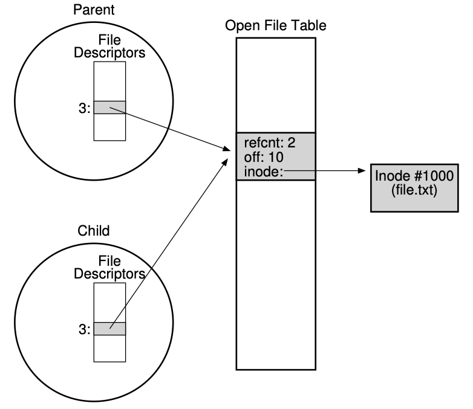
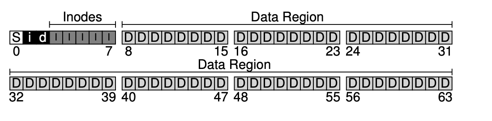

# Files and Directories

## Intro

- **Persistent storage**: e.x. classic hard disk drive or solid-state storage device
    - Store information permanently
    - Unlike memory, where contents are lost when there is a power lost

## What is a file

- **File:** array of persistent bytes that can be read / written
- Low-level name of a file is called i-node number. 
- **File system** consists of many files
    - Refers to collection of files
    - Also refers to part of OS (e.x. ext3, ext4, NTFS, etc.) that manages those files
- Files need names to access correct one, and there are three types of names
    - Unique id: inode number
    - Path
    - File descriptor
- Directory: like a file, but contains a list of (user-readable name, low-level name)
  - It also has a low-level name (e.g. inode number)
  - e.g.  (“foo”, “10”)

## Paths

- String names are friendlier than number names
- File system still interacts with inode numbers
- **Directory tree** instead of single root directory
- **File name** needs to be unique within a directory
- Store **path-to-inode mappings** in each directory
    - Reading for getting final inode is called “traversal”

## File Descriptor (FD)

- `open()` returns: a file descriptor. A file descriptor is just an integer, private per process, and is used in UNIX systems to access files; thus, once a file is opened, you use the file de- scriptor to read or write the file, assuming you have permission to do so.
  - File descriptor is as a pointer to an object of type file
- Idea
    - Do expensive traversal once (open file)
    - Store inode in descriptor object (kept in memory)
    - Do reads / writes via descriptor, which **tracks offset**
- Each process: file descriptor table contains pointers to **open file descriptors**
- Integer used for file I/O are indexes to this table
    - stdin: 0, stdout: 1, stderr: 2
  - The subsequent file descriptors start from 3. 
```c
struct proc {
    ...
    struct file *ofile[NOFILE];
    ...
}
```
- the `file` array is indexed by the file descriptor. 

## Interface
```c
int fd = open(char *path, int flags, mode_t mode);
read(int fd, void *buf, size_t nbyte);
write(int fd, void *buf, size_t nbyte);
close(int fd);
```
- If an attempted `read()` past the end of the file returns zero, it indicates to the process that it has read the file in its entirety.
- Advantages
    - String names
    - Hierarchical
    - Traverse once
    - Offsets precisely defined (especially when multiple processes are sharing)

## Reading And Writing, But Not Sequentially

```c
    off_t lseek(int fildes, off_t offset, int whence);
```
Values that `whence` can take: 
```
  If whence is SEEK_SET, the offset is set to offset bytes.
  If whence is SEEK_CUR, sthe offset is set to its current
    location plus offset bytes.
  If whence is SEEK_END, the offset is set to the size of
    the file plus offset bytes.
```
OS tracks a current `offset` for each file that it opens. 
`read` and `write` also changes the current `offset`.

In `struct file`: 
```c
struct file {
  int ref;
  char readable;
  char writable;
  struct inode *ip;
  uint off;
};
```

- Open file table. The xv6 kernel just keeps these as an array, with one lock for the entire table.
```c
struct {
  struct spinlock lock;
  struct file file[NFILE];
} ftable;
```

## Sharing files

- `fork`: increments the reference count. Parent and child shares the file.
- For example, if you create a number of processes that are cooperatively working on a task, they can write to the same output file without any extra coordination.
- 
- The `dup()` call allows a process to create a new file descriptor that refers to the same underlying open file as an existing descriptor.

## FSYNC: communicating requirements

- Most times when a program calls write(), it is just telling the file system: please write this data to persistent storage, at some point in the future.
- File system keeps newly written data in memory for a while
    - Write buffering improves performance
- If system crashes before buffers are flushed, then lose data
- `fsync(int fd)`
    - Forces buffer to flush to disk
    - Tells disk to flush its write cache
    - Makes data durable
- In the UNIX world, the interface provided to applications is known as `fsync(int fd)`. When a process calls `fsync()` for a particular file descriptor, the file system responds by forcing all dirty (i.e., not yet written) data to disk, for the file referred to by the specified file descriptor. The `fsync()` routine returns once all of these writes are complete.

## Renaming files

- One interesting guarantee provided by the rename() call is that it is (usually) implemented as an atomic call with respect to system crashes; if the system crashes during the renaming, the file will either be named the old name or the new name, and no odd in-between state can arise.

## Getting information about a file

- `fstat`: contain information stored in places such as inode.
- Inode is a persistent data structure, but are cached in memory for performance reasons.

## Reading directories
- `opendir()`, `readdir()`, and `closedir()`
- `struct dirent` data structure
```c
struct dirent {
  char d_name[256]; // filename
  ino_t d_ino; // inode number
  off_t d_off; // offset to the next dirent
  unsigned short d_reclen; // length of this record
  unsigned char  d_type; // type of file
};
```

## Deleting Files

- There is no system call for deleting files!
  - It just calls `unlink()`.
- Inode (and associate file) is **garbage collected** when there are no references
    - Paths are deleted when `unlink()` is called
    - FDs are deleted when `close()` or process quits
- `link`: an old pathname and a new one; when you “link” a new file name to an old one, you essentially create another way to refer to the same file.
- The way `link()` works is that it simply creates another name in the directory you are creating the link to, and refers it to the same inode num- ber (i.e., low-level name) of the original file. The file is not copied in any way;
- Hard link
  - `ln` command
    - Hard links are somewhat limited: you can’t create one to a directory (for fear that you will create a cycle in the directory tree); you can’t hard link to files in other disk partitions (because inode numbers are only unique within a particular file system, not across file systems); etc. Thus, a new type of link called the symbolic link was created
    - A hard link is essentially another name for an existing file on disk
        - All hard links to a file point to the same inode, and the same data blocks
- What `unlink` does:
  - First, you are making a structure (the inode) that will track virtually all relevant infor- mation about the file, including its size, where its blocks are on disk, and so forth. Second, you are linking a human-readable name to that file, and putting that link into a directory.
  - The reason this works is because when the file system unlinks file, it checks a reference count within the inode number. This reference count (sometimes called the link count) allows the file system to track how many different file names have been linked to this particular inode. 
    - only when the reference count reaches zero does the file system also free the inode and related data blocks, and thus truly “delete” the file.
- Soft link (symbolic link)
    - `ln -s`. 
    - Difference
        - A symbolic link is actually a file itself, of a different type
        - A symbolic link is a separate file that contains a reference to another file or directory in the form of an absolute or relative path to target
            - Have their own inode numbers
    - Potential problem
        - Dangling reference
        - Quite unlike hard links, removing the original file named file causes the link to point to a pathname that no longer exists

## Permission Bits and ACL

- UNIX: **permission bits**
    - Three groupings of permissions
        - What the **owner** of the file can do to it
        - What someone in a **group** can do to the file
        - What anyone (i.e. **other**) can do

- **Access control list (ACL)**
    - More complicated control to represent exactly who can access a given resource
    - Enable a user to create a specific list of who can and cannot read a set of files
        - V.s. limited owner / group / everyone model of permission bits
    - E.x. AFS

## Making and Mounting FS

- Make a file system: `mkfs`
    - Give the tool, as input, a device (e.g. a disk partition), a file system type (e.g., ext3)
    - Write an empty file system, start with root directory, onto that disk partition
- To make a FS accessible within the uniform file-system tree: `mount`
    - Idea: take existing directory as a **target mount point** and essentially paste a new FS onto the directory tree at that point

# File System Implementation: Very Simple File System 

## Overall Organization 

- **block**: commonly 4KB
- **How to store it?**
    - **Data region**: the region of disk used for user data
    - **Metadata:** keep track of information about each file
        - the size of the file, its owner and access rights, access and modify times, and other similar kinds of information
        - File systems usually have a structure called an inode
        - This portion of the disk is the **inode table**
    - **Allocation structure:** track whether inodes or data blocks are freed or allocated
        - E.x. free list: points to the first free block, then the next
        - E.x. **bitmap: data bitmap (d), inode bitmap (i)  (0 for free, 1 for in-use)**
        - Chosen in the example below
    - **Superblock:** contains the information about the particular file system
        - E.x. how many inodes and data blocks are in the file system, where the inode table begins, identify the file system type, etc.
    - 
- E.x. when mounting a FS
    - OS will read the superblock first to initialize various parameters, then attach the volume to the file system tree
    - When files within the volume are accessed, the system will know exactly where to look for the needed on-disk structure

## File Organization: The Inode 

- Inode: index node 
  - Used because these nodes where originally arranged in an array, and the array indexed into when accessing a particular node
  - Generic name used in FS to describe the structure that holds the metadata for a given file (i.e. length, permissions, location of its blocks)
  - referred to with i-number. 
  - Each inode stores a bunch of pointers. 
- Information
    - Type: regular, directory, etc.
    - Size
    - Number of blocks allocated to it
    - Protection information (who owns the file, who can access it)
    - **Some time information (when the file was created, modified, last accessed)**
    - Where its data block reside on disk
        - How?
            - Direct pointers (disk addresses) inside each inode
              - We need an inode per data block.
              - For a 36KB file, if each data block is 4KB, we need 9 data blocks. and 9 direct pointers to these 9 data blocks. 
                - Cons: limited, you want to have file really big (i.e. bigger than block size)?
                - **Multi-level index: indirect pointer**
                    - Instead of pointing to a block that contains the user data
                    - Points to a block that contains more pointers, each of which point to the user data
                    - An inode may have some fixed number of direct pointers, and a single indirect pointer
                    - Even larger file: **double indirect pointer**
                        - Refers to a block that contains pointers to indirect blocks
                        - Each of which contain pointers to data blocks
                    - E.x. Linux ext2, ext3, UNIX file system
                - Others use **extents** instead of pointers
                    - Akin to segments in virtual memory
                    - Simply a disk pointer plus a length (in blocks)
                    - Instead of requiring a pointer for every block of a file, all one needs is a pointer and a length to specify the on-disk location of a file
                    - Just a single extent is limiting, as one may have trouble finding a contiguous chunk of on-disk free space when allocating a file. Thus, extent-based file systems often allow for more than one extent, thus giving more freedom to the file system during file allocation
                - **Pointer v.s Extent**
                    - Pointer: more flexible but use large amount of metadata per file (particularly for large file)
                    - Extent: less flexible but more compact, work well when there is enough free space on the disk and files can be laid out contiguously

## Why pointers at this time? i.e. imbalanced tree?
- Finding!
    - Most files are small, it makes sense to optimize for this case
        - Small # of direct pointers

### Others

- Linked list: instead of having multiple pointers, just need one to point to first block of the file
    - Performs poorly for some workloads: i.e. reading last block, or doing random access
- Some system keeps in-memory table of link information
    - Table indexed by address of data block D
    - Content of an array is D’s next pointer
    - Having such table makes it so that linked allocation scheme can effectively do random file accesses, by first scanning through (in-memory) table to find the desired block and accessing (on disk) it directly
    - Basics of **file allocation table (FAT) file system**
        - I.e. classic old Windows file system


### File Allocation Table (FAT)

- **How to design an inodes to point to data blocks?**
- Baseline: use linked list
    - One pointer, points to the first block of the file, and add another pointer at the end of that data block, etc. to support large files
    - Poor performance: random access, or access offset of the file, etc.
- File Allocation Table
    - In-memory table of link information instead of storing next pointers with the data blocks
    - Indexed by address of data block $D$
    - Content of entry: $D$’s next pointer (i.e. the address of next block in file which follows $D$) d
        - Marker to indicate EOF and whether a particular block is free
    - Directory entries
        - No inode per se
        - Directory entries that store metadata about a file and refer directly to the first block of said file
- How does this compare with inode-based structure?
    - In memory mapping then eliminate the need of traversal
    - But not in-memory, then inode-structure has much better random read performance
        - And also inode-structure can have hard links
        - 

## Directory Organization

- A directory basically just contains a list of (entry name, inode number) pairs
- For each file or directory in a given directory
    - There is a string and a number in the data block(s) of the directory
    - For each string, there may also be a length
- Each entry has an inode number, record length (the total bytes for the name plus any left over space), string length (the actual length of the name), and finally the name of the entry.


## Free space management

- The system must track which inodes and data blocks are free, and which are not
- When a new file or directory is created, it is able to find the space for it
- **Free space management** with two bit maps
    - First, search through bitmap for an inode that is free, and allocate it to the file, marked it as used, and update the bitmap eventually
    - Update the data block similarly
- **Pre-allocation policy**: look for contiguous blocks
  - For example, some Linux file systems, such as ext2 and ext3, will look for a sequence of blocks (say 8) that are free when a new file is created and needs data blocks; by finding such a sequence of free blocks, and then allocating them to the newly-created file, the file system guarantees that a portion of the file will be contiguous on the disk, thus improving performance.

## Access paths: reading and writing 

### Reading

- The file system must **traverse** the pathname and thus located the desired node
- All traversals begin at the root of the file system, in the **root directory**
- The amount of I/O generated by the open is proportional to the length of the pathname
    - For each additional directory in the path, read its inode and data

All traversals begin at the root of the file system, in the root directory which is simply called /. Thus, the first thing the FS will read from disk is the inode of the root directory. In most UNIX file systems, the root inode number is 2. Thus, to begin the process, the FS reads in the block that contains inode number 2 (the first inode block). Once the inode is read in, the FS can look inside of it to find pointers to data blocks, which contain the contents of the root directory. The FS will thus use these on-disk pointers to read through the directory, in this case looking for an entry for foo. By reading in one or more directory data blocks, it will find the entry for foo; once found, the FS will also have found the inode number of foo (say it is 44) which it will need next. The next step is to recursively traverse the pathname until the desired inode is found. In this example, the FS reads the block containing the inode of foo and then its directory data, finally finding the inode number of bar. The final step of open() is to read bar’s inode into memory; the FS then does a final permissions check, allocates a file descriptor for this process in the per-process open-file table, and returns it to the user.

### Writing

- Allocate a file
    - Read to inode bitmap (to find a free inode)
    - Write to inode bitmap (mark it allocated)
    - Write to new inode itself (to initialize it)
    - One to data of the directory (link high-level name of the file to its inode number)
    - One read and write to the directory inode and update it

- Modern systems, in contrast, employ a dynamic partitioning approach. Specifically, many modern operating systems integrate virtual memory pages and file system pages into a unified page cache

- **Caching on writes**: **buffering** 
    - Write buffering 
        - Pros 
            - Delay writes, file system can batch updates into smaller set of I/Os      
            - Schedule the subsequent I/O and thus increase performance 
            - Some writes are avoided altogether by delaying them (i.e. create and then delete) 
        - Cons
            - If system crash before update propagated, updates are lost 
            - Keeping writes in memory longer, performance can be improved by batching, scheduling, and even avoiding writes