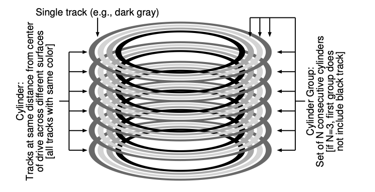

# Fast File System (1984) 
The old UNIX file structure consists of large chunks of super block, inode region, and data region: data was spread all over the place ignoring positioning cost, data blocks are often very far away from the inode. 

Problems: all about performance 
1) _The old FS only deliver 2% of the overall bandwidth_
2) Fragmented FS
3) Original block size was too small, positioning overhead is huge

FFS is the first disk-aware file system that improves performance by changing FS structures and allocations policies. 

## Goal: performance 
Key optimizations:
* Improve locality of the data structures
  *   Keep related stuff together
  *   Use disk block _groups_ to keep files within consecutive blocks 
  *   File inodes allocate in the same group with directory
  *   Directory inodes allocated in new group with fewer used inodes than average group
  *   First data blocks allocated near inodes
  *   Other data blocks allocate near data blocks
* Reduce fragmentation of disk blocks by allocating contiguously from the bit maps
* Increase block size to inmprove performance
  *   To mitigate internal fragmentation, also uses sub-blocks
 
## Secondary goal: usability    
* Long file names
* Atomic rename
* Symbolic links
  *  hard link limited, can't point to directories, can't point to files across volumes    

# Locality and the Fast File System (FFS) 

The old UNIX file system data structures look like this:

- Superblock: information about the entire FS
- Inode region: contain all inodes for the file system
- Most disk is taken up by the data blocks
- 

## Problem

- **Performance**
    - FS only deliver 2% of the overall disk bandwidth!
    - Issue: old UNIX FS treated disk like it was random-access memory
        - Data was spread all over the place ignoring the positioning costs
        - Data blocks are often very far away from inode
- The file system get **fragmented**
    - Free space are not carefully managed
    - Free list ended up pointing to a bunch of blocks spread across the disk。
    - The result was that a logically contiguous file would be accessed by going back and forth across the disk, thus reducing performance dramatically.
- Original block size was too small (i.e. 512 bytes)
    - Transferring data from disk was inherently inefficient
    - Smaller blocks were good to minimized **internal fragmentation** (i.e. waste space within the block), but bad for transfer as each block might require a positioning overhead to reach it

## FFS: Disk Awareness is the Solution

- A group at Berkeley decide to build a better, faster file system!
- Fast File System (FFS)
    - The idea was to design the file system structures and allocation policies to be “disk aware” and thus improve performance
    - Keep the same interface to the file system (i.e. same API)
    - But change the internal implementation

### Organizing structure: the cylinder group

- Cylinder: multiple tracks that are of the same distance.
- Cylinder group: multiple cylinders arranged in a group.
- modern drives do not export enough information for the file system to truly understand whether a particular cylinder is in use;
- instead organize the drive into block groups, each of which is just a consecutive portion of the disk’s address space. 
1. **Change the on-disk structures** 
    1. **Key idea:** keep inode close to data 
        1. Use group across disks
        2. Strategy: allocate inodes and data blocks in the same group 
    2. FFS: groups are ranges of cylinders called **cylinder groups**
        1. In ext2, ext3, ext4, groups are ranges of blocks, called block group 
    3. A single **cylinder**
        1. Set of tracks on different surfaces of a hard drive that are the same distance from the center of the drive 
    4. FFS aggregates $N$ consecutive cylinders into a group

### Policies: how to allocate files and directories

- Basic idea: *keep related stuff together (keep unrelated stuff far apart!)*
- Rules
    1. Put directory entries near directory inodes
    2. Put inodes near directory entries 
    3. Put data blocks near inodes 
- Problems: file system is one big tree, all directories and files have a common root
    - All data in same FS is related in some way!
    - Trying to put everything near everything else doesn’t make any choices!
- **Revised strategy**
    - File inodes: allocate in the same group with directory
    - Directory inodes: allocate in new group with fewer used inodes than average group
    - First data block: allocate near inodes
    - Other data blocks: allocate near previous block
- A per-group inode bitmap (ib) and data bitmap (db) serve this role for inodes and data blocks in each group. Bitmaps are an excellent way to manage free space in a file system be- cause it is easy to find a large chunk of free space and allocate it to a file, perhaps avoiding some of the fragmentation problems of the free list in the old file system.
- Problem: large files, which can fill nearly all of a group, displace data for many small files
    - Assumption: most files are small! Better to do one seek for large file than one seek for each of many files
        - Define large file as requiring an indirect block
    - **Policy**
        - Large file data blocks: after 48KB, go to new group
        - Move to another group (w/ fewer than average blocks) every subsequent 4MB
    - Without large-file exception:
      - 
    - With large file exception:
      - 
    - Specifically, if the chunk size is large enough, the file system will spend most of its time transferring data from disk and just a (relatively) little time seeking between chunks of the block. This process of reducing an overhead by doing more work per overhead paid is called amortization and is a common technique in computer systems.
    - Note that the trend in disk drives is that transfer rate improves fairly rapidly, as disk manufacturers are good at cramming more bits into the same surface, but the mechanical aspects of drives related to seeks (disk arm speed and the rate of rotation) improve rather slowly. The implication is that over time, mechanical costs become relatively more expensive, and thus, to amortize said costs, you have to transfer more data between seeks.

### Other FFS Features: usability

- Sub-blocks (which were 512-byte little blocks that the file system could allocate to files.)
  - Before 4KB blocks are good for transferring, but might lead to internal framgmentation.
  - As the file grew, the file system will continue allocating 512-byte blocks to it until it acquires a full 4KB of data. At that point, FFS will find a 4KB block, copy the sub-blocks into it, and free the sub-blocks for future use.
    - FFS can also modify the libc to buffer writes and then issue them in 4KB chunks to the file system. 
- Large blocks (with libc buffering / fragments)
- Long file names
- Atomic rename
    - `rename` operation for renaming files
- Symbolic links
    - hard links are limited in that they both could not point to directories (for fear of introducing loops in the file system hierarchy) and that they can only point to files within the same volume (i.e., the inode number must still be meaningful).
    - Symbolic links allow the user to create an “alias” to any other file or directory on a system and thus are much more flexible
- Problem: 
  - FFS would first issue a read to block 0; by the time the read was complete, and FFS issued a read to block 1, it was too late: block 1 had rotated under the head and now the read to block 1 would incur a full rotation.
  - FFS was smart enough to figure out for a particular disk how many blocks it should skip in doing layout in order to avoid the extra rotations; this technique was called parameterization, as FFS would figure out the specific performance parameters of the disk and use those to decide on the exact staggered layout scheme.
  - Fortunately, modern disks are much smarter: they internally read the entire track in and buffer it in an internal disk cache (often called a track buffer for this very reason). Then, on subsequent reads to the track, the disk will just return the desired data from its cache.

## FFS Summary

First disk-aware file system 

- Bitmaps
- Locality groups
- Rotated superblocks
- Smart allocation policy

Inspired modern file system, including ext2 and ext3

### Fast File System (FFS)

First disk-aware file systems: 

- Motivation
    - Old UNIX file system structure has bad performance (i.e. data spread all over the place, data blocks away from inode)
    - File system get fragmented, free list ended up pointing to bunch of blocks spread across the disk
    - Original block size too small
- The idea was to design the file system structures and allocation policies to be “disk aware” and thus improve performance
- Organizing structure: cylinder group (i.e. locality groups)
    - Use group across disks
        - Groups are ranges of cylinders
    - Keep related stuff together: allocate inodes and data blocks in the same group
        - File inodes are allocate in the same group with directory
        - Directory inodes are allocated in new group with fewer used inodes than average group
        - First data blocks allocate near inodes
        - Other data blocks allocated near previous blocks
- Usability
    - Long file names
    - Atomic rename
    - Symbolic links
