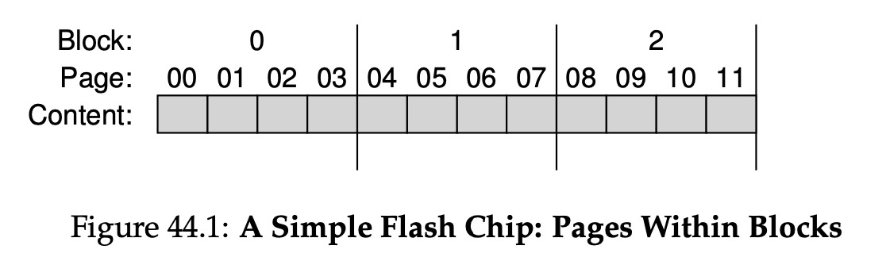
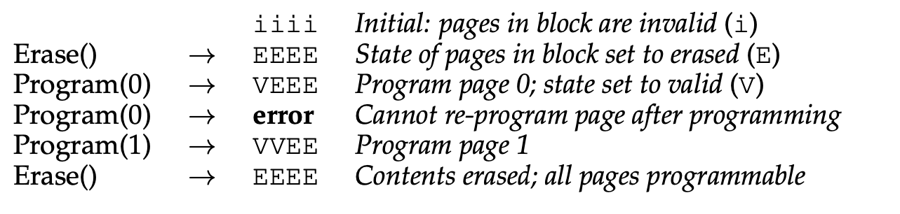
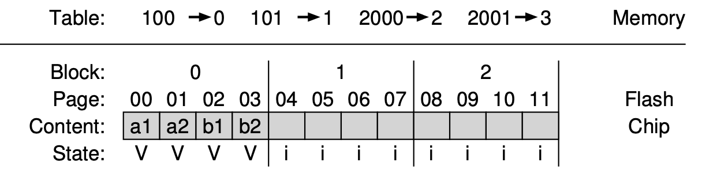

# Flash-based SSDs 

## What is SSD

- Flash is a technology by which data is stored while SSDs are a storage device. Not all SSDs use flash as their storage medium, but most currently on the market do.
- SSD is **solid-state storage device**
- Such devices have no mechanical or moving parts like hard drives
- They simply built out of transistors, much like memory and processors
- However, unlike typical DRAM, such SSD device retains information despite power lost
- Technology focusing on: **flash** (i.e. **NAND-based flash**), created in 1980s
    - To write a chunk (i.e. a **flash page**), have to erase a bigger chunk (i.e. **flash block**)
    - Writing too often to a page will cause it to **wear out**

## Storing a single bit

- Flash chips are designed to store one or more bits in a single transistor
    - Single-level cell (SLC) flash
    - Multi-level cell (MLC) flash
    - Triple-level cell (TLC) flash
  - In a single-level cell (SLC) flash, only a single bit is stored within a transistor (i.e., 1 or 0); with a multi-level cell (MLC) flash, two bits are encoded into different levels of charge, e.g., 00, 01, 10, and 11 are repre- sented by low, somewhat low, somewhat high, and high levels. There is even triple-level cell (TLC) flash, which encodes 3 bits per cell. 

## From Bits to Banks / Planes

- Flash chips are organized into **banks** or **planes** which consist of a large number of cells
- A bank is accessed with two different sized unit
    - **Blocks** (i.e. erase block)
        - ~128 kB or 256 KB
    - **Pages**
        - Few KB in size
- Within each bank, large # of blocks
- Within each block, large # of pages
- 

## Basic Flash Operations

- `read` (a page)
    - read page from the flash
    - ~10 ms, regardless of location on the device, and previous request location
    - Being able to access any location uniformly —> device is a **random access** device
- `erase` (a block)
    - Before writing a page, need to first erase the entire block
    - Expensive operation, few ms to complete
- `program` (a page)
    - Once a block has been erased, the program command can change some of the 1’s within a page to 0’s, and write the desired contents of a page to the flash
    - Less expensive than erasing a block
    - More costly than reading a page
    - ~100s ms on modern flash chips
- 

## Reliability

- Flash chips are pure silicon and have fewer reliability issues to worry about
- Primary concern: **wear out**
    - When a flash block is erased and programmed, it slowly accrues some extra charge
    - Extra charge builds up, difficult to differentiate between 0 and 1
- Another issue: **disturbance**
    - When accessing a particular page, it is possible that some bits get flipped in neighboring pages
    - Such bit flips are: **read disturbs** or **program disturbs**

## From Raw Flash to Flash-Based SSDs 

An SSD consists of 

1. Some number of flash chips (for persistent storage)
2. Some amount of volatile (i.e. non-persistent) memory (e.g. SRAM) 
    1. Caching, buffering 
3. Control logic to orchestrate device operation 
    1. **Flash translation layer (FTL)**: satisfy client R/W, turning into internal flash operations

Performance optimizations

1. Use multiple flash chips in parallel 
2. Reduce write amplification (i.e. total write traffic issued to flash chips by FTL / total write traffic issued by the client) 

Reliability optimizations 

1. Wear out? 
    1. FTL should try to spread writes across blocks of the flash as evenly as possible 
    2. Do **wear leveling** 
2. Program disturbance? 
   1. When accessing a particular page within a flash, it is possible that some bits get flipped in neighboring pages; such bit flips are known as read disturbs or program disturbs, depending on whether the page is being read or programmed, respectively.
    2. FTL will commonly program pages within an erased block in order, from low page to high page

## FTL organization: bad approach - direct mapped

- The FTL takes read and write requests on logical blocks (that comprise the device interface) and turns them into low-level read, erase, and program commands on the underlying physical blocks and physical pages (that com- prise the actual flash device).
- Write amplification:
  - Another performance goal will be to reduce write amplification, which is defined as the total write traffic (in bytes) issued to the flash chips by the FTL divided by the total write traffic (in bytes) issued by the client to the SSD. 
- Read to logical page N is mapped o read a physical page N
- Cons
    - Performance
        - Each write needs to read the entire block, erase it, then program it
        - Severe write amplification (prop. to # of pages in a block)
    - Reliability
        - Same block is erased and programmed over and over, wear out issue

## Log-structured FTL 
- Write logging
    - Upon write to a logical block N, the device appends the write to the next free spot in the currently-being-written-to block
- Mapping table
    - Store physical address of logical block in the system
    - Kept in memory, and persistent on the device
- Log based approach
    - Improve performance
        - Erase only being required once in a while
        - Costly read-modify-write of direct-mapped are avoided
    - Enhance reliability
    - Spread writes across pages
        - Wear leveling
        - Increase the lifetime of the device
- 
- Garbage collection
    - Finding a block that contains one or more garbage pages, read in live pages from that block, write out those to log, reclaim the entire block for use in writing
    - Some SSDs over-provision the device to reduce GC costs
        - Increase internal bandwidth used for cleaning
        - Cleaning can be delayed and pushed to the background
- Mapping table size
    - With a large 1-TB SSD, for example, a single 4-byte entry per 4-KB page results in 1 GB of memory needed by the device, just for these mappings! Thus, this page-level FTL scheme is impractical.
    - Block-based mapping
        - Only keep a pointer per block of the device, instead of per page
        - Pros: reduce memory needed for translations
        - Cons: performance on small write (< physical block size)
    - **Hybrid mapping**
        - FTL keeps a few blocks erased and direct all writes to them (i.e. **log blocks**)
        - Keeps per-page mappings for these log blocks
            - Able to write any page to any location within the log block
        - Hybrid mapping: Two types of mapping
            - Per-page mapping: log table
            - Per-block mapping: data table
        - Process
            - Consult the log table
            - If logical block is not found there, then consult the data table then access
        - Key: keeping the # of log blocks small (i.e. examine log blocks and switch them into blocks)
      - 
      <!-- - Switch merge: log block 0 now become the storage location for blocks 0, 1, 2, 3 -->

  - Switch merge: In this case, the log block (0) now becomes the storage location for blocks 0, 1, 2, and 3, and is pointed to by a single block pointer; the old block (2) is now erased and used as a log block.
  - Full merge: In this case, the FTL must pull together pages from many other blocks to perform cleaning. 

## Wear Leveling

- Basic idea
    - because multiple erase / program cycles will wear out a flash block
    - FTL should try its best to spread that work across all the blocks of the device evenly
- Log-structured approach
    - Spread out write load
    - Garbage collection helps as well
- Another situation: long-lived data never got over-written, GC won’t collect it
    - FTL need to periodically read all the live data out of such blocks and re-write it somewhere else, making the block available for writing again
    - This process of wear leveling increases write amplification of SSD, decrease performance as extra I/O

### Performance

- Much better in random reads and random writes than HDD
- Sequential performance is less of a different
- SSD random read not as good as random write
- Why unexpectedly good random write performance?
    - Due to log-structured design of many SSDs, which transform random writes into sequential ones to improve performance
- Still gaps in sequential and random access performance

### Cost

- Cost per unit of capacity!
    - Prevent usage of SSD
    - SSD: $150 for a 250GB drive, 60 cents per GB
    - HDD: $50 for 1TB, 5 cents per GB