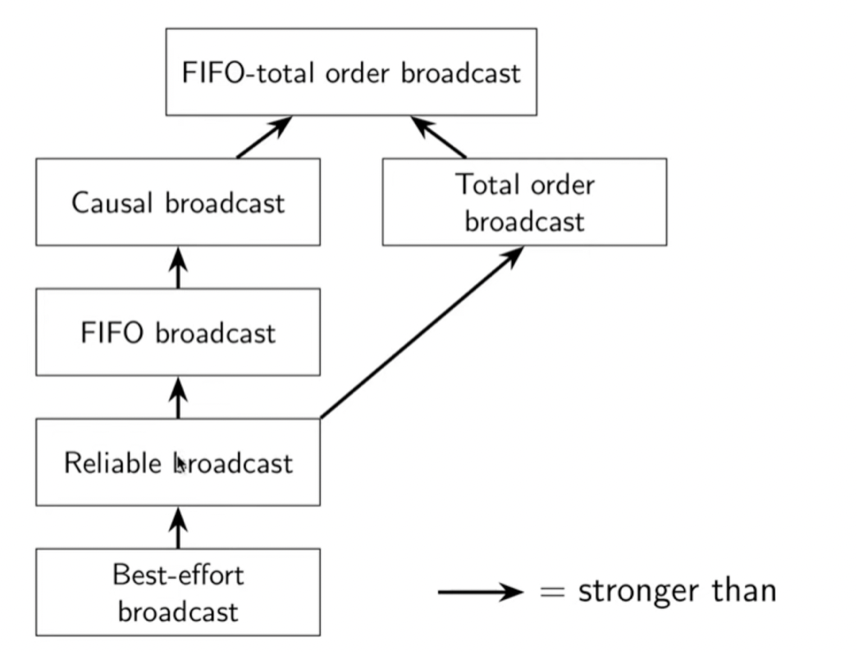

# Distributed Systems

- Distributed shared memory (DSM) systems enable processes on different machines to share a large, virtual address space
  - This approach is not widely in use today for a number of reasons. The largest problem for DSM is how it handles failure.

## RPC

### Stub Generator
  - The input to such a compiler is simply the set of calls a server wishes to export to clients. Conceptually, it could be something as simple as this:

```c
interface {
  int func1(int arg1);
  int func2(int arg1, int arg2);
};
```
  - The stub generator takes an interface like this.  For the client, a client stub is generated, which contains each of the functions specified in the interface; a client program wishing to use this RPC service would link with client stub and call into it in order to make RPCs.
  - To the client, the code just appears as a function call (e.g., the client calls `func1(x)`); internally, the code in the client stub for `func1()` does:
    - Create a message buffer. A message buffer is usually just a contiguous array of bytes of some size.
    - Pack the needed information into the message buffer: marshaling of arguments or the serialization of the message.
    - Send the message to the destination RPC server.
    - Wait for the reply. Because function calls are usually synchronous, the call will wait for its completion.
    - Unpack return code and other arguments. This step is also known as unmarshaling or deserialization.
    - Return to the caller. Finally, just return from the client stub back into the client code.

### Run-time library

- Many RPC packages are built on top of unreliable com- munication layers, such as UDP.
- The run-time must also handle procedure calls with large arguments, larger than what can fit into a single packet. Some lower-level network protocols provide such sender-side fragmentation (of larger packets into a set of smaller ones) and receiver-side reassembly (of smaller parts into one larger logical whole); if not, the RPC run-time may have to implement such functionality itself.
- One issue: byte ordering. 
  - Big endian ordering vs. little endian ordering. 
  - Big endian stores bytes (say, of an integer) from most significant to least significant bits, much like Arabic numerals; little endian does the opposite. 
- Server regards to concurrency? —> thread pool 
    1. Threads are created when server starts
    2. When message arrives, dispatched to one of the worker threads 
    3. Main thread keeps receiving data 
# Networked and Distributed Systems

## Concepts Explain

### Remote Procedure Calls (RPCs) and their implementation

1. OS abstraction: distributed shared memory (DSM)
    1. Through virtual memory system of the OS 
    2. Not widely used today for reliable distributed system 
        1. Failure handling is hard
            1. machine fails, data structure unavailable, addr space missing, etc. 
        2. Performance: remote fetching 

### Reliable Transport: UDP v.s TCP

1. **UDP (User Datagram Protocol) - Unreliable Communication Layer** 
    1. API
        1. Reads and writes over socket API (FDs) 
        2. Messages sent from / to ports to target a process on machine 
    2. Provide minimal reliability features 
        1. Messages may be lost
        2. Messages may be reordered
        3. Messages may be duplicated
        4. Only protection: checksums to ensure data not corrupted (i.e. for integrity) 
2. **TCP (Transmission Control Protocol) - Reliable Communication Layer** 
    1. Use software to build reliable logical connections over unreliable physical connections 
        1. No duplicates, message received exactly once 
    2. Scheme
        1. ACKS: Receiver send ack upon receiving messages 
        2. TIMEOUT: Sender timeout when not receiving ack, and retry 
            1. Adaptive timeouts 
        3. SEQUENCE COUNTER 
            1. Senders give each message an increasing unique sequence number
            2. Receiver knows it has seen all messages before $N$ 
            3. Suppose message $K$  is received 
                1. If $K <= N,$ Msg $K$  is already delivered, ignore it 
                2. If $K = N +1$, first time seeing this message 
                3. If $K > N+1$, buffer this message so arrive in order 

### Security

- **Cryptography** achieves protection by converting data’s original bit pattern into a different bit pattern, using an algorithm called cipher
- **Symmetric key encryption** (ciphers): using a single secret key shared by all parties with rights to access the data
    - Pros: simplicity, speedy
    - Cons: key distribution problem (i.e. if someone intercepts the key during transmission, whole system compromise), doesn’t provide non-repudiation (i.e. the ability to prove that a sender is the true sender)
- **Public-key encryption**: have two different keys for cryptography, one to encrypt and one to decrypt, with one keys kept secret and the other commonly made public
    - Pros: solve the key distribution problem, secure key exchange
    - Cons: speed, complexity
- **Cryptographic hashes**: special category of hash function with important properties
    - Computationally infeasible to find two inputs that will produce the same hash value
    - Any change to input will result in unpredictable change to resulting hash value
    - Computationally infeasible to infer any properties of the input based on the hash value
    - Note: no key, no one should be able to obtain the original bit patterns from the hash
    - Then, care about data integrity?
        - Take crypto hash of the data, encrypt only that hash, send both the encrypted hash and unencrypted data to partner
        - If opponent fiddles with the data in transit, decrypt the hash and repeating the hashing operation on data, find mismatch

## System Model

For each of the three parts:

### Network 
1. Reliable: Assumes all messages will be successfully delivered.
2. Fair-loss: Assumes messages may be lost but will eventually get through.
3. Arbitrary: No assumptions about message delivery.
### Nodes 
1. Crash-stop: Nodes will stop and not recover.
2. Crash-recovery: Nodes can recover after a crash.
3. Byzantine: Nodes can act arbitrarily, including maliciously.
- **Timing:** synchronous, partially synchronous, or asynchronous
    - Synchronous: message latency no greater than a known upper bound
    - Partial synchronous: async for some finite (but unknown) period of time, sync otherwise
    - Async: messages can be delayed arbitrarily, nodes can pause execution arbitrarily, no timing guarantees at all

- **Happens before relation**
    - An event is something happening at one node (sending, or receiving message, or local execution step)
    - We says event $a$  happens before event $b$ (written $a \rightarrow b$) iff
        - $a$ and $b$ occurred at the same node, and $a$ occurred before $b$ in that node’s local execution order
        - Or event $a$  is sending some message $m$, ad event $b$ is receiving that same mesage $m$ (assuming sent messages are unique)
        - There exists some event $c$ such that $a \rightarrow c$ and $c \rightarrow b$
        - Partial order: it is possible that $a \rightarrow b$ nor $b \rightarrow a$, in that case $a$ and $b$ are concurrent (i.e. $a || b)$
- **Causality**
    - Taking from physics (relativity)
        - When $a \rightarrow b$, then $a$ **might have caused** $b$
        - When $a || b$, we know that $a$ **cannot have caused** $b$
    - Happens before relation encodes **potential causality**

- 

- Choice of retry semantics
    - **At-most-once**: send request, don’t retry, update may not happen
    - **At-least-once**: retry request until ed ACK, may repeat update
    - **Exactly-once**: retry + idempotence or deduplication

## State machine replication

- Broadcast protocol to do replication!
- Total order broadcast: every node delivers the **same messages** in **same order**
- **State machine replication (SMR)**
    - **FIFO-total order** broadcast every update to all replicas
    - Replica delivers update message: apply it to own state
    - Applying an update is deterministic
        - Each replica is state machine, state is all data it’s stored
            - Go through same sequence of state transitions in the same order
            - Ended up in the same state


### Consensus system models

- Paxos, Raft, etc. assume a **partially synchronous, crash-recovery** system model
- Why not async?
    - **FLP result**: there is no deterministic consensus algorithm that is guaranteed to terminate in an async crash-stop system model
    - Paxos, Raft, etc. use clocks only used for timeouts / failure detector to ensure progress. Safety (correctness) does not depend on timing.
- There are also consensus algorithms for a partially synchronous Byzantine system model (used in blockchains)
    - More complex! Less efficient

### Leader election

- Multi-paxos, Raft, etc. use a leader to sequence messages
    - Use a **failure detector** (timeout) to determine suspected crash or unavailability of leader
    - On suspected leader crash, **elect a new one**
    - Prevent **two leaders at the same time** (”split-brain”)!

## System Model 

## SSL / TLS: a protocol, not a software package

- Standard method of communicating between processes in modern system is socket
- Secure Socket Layer (SSL)
    - Formally is insecure
    - Move encrypted data through an ordinary socket
    - I.e. set up a socket, set up a special structure to perform crypto, then hook the output of that structure to the input of the socket, reverse the process on the other end
    - Steps
        - Start negotiation between client and server
        - End in both sides finding some acceptable set of ciphers and techniques that balance between performance and security
            - I.e. Diffie-Hellman key exchange to create the key
- Transport Layer Security (TLS)
    - Use this
    - Evolved from SSL.
    - It should be noted that TLS does not secure data on end systems. It simply ensures the secure delivery of data over the Internet, avoiding possible eavesdropping and/or alteration of the content.
    - TLS is normally implemented on top of TCP in order to encrypt Application Layer protocols such as HTTP, FTP, SMTP and IMAP, although it can also be implemented on UDP, DCCP and SCTP as well 
    - However, SSL is an older technology that contains some security flaws. Transport Layer Security (TLS) is the upgraded version of SSL that fixes existing SSL vulnerabilities.