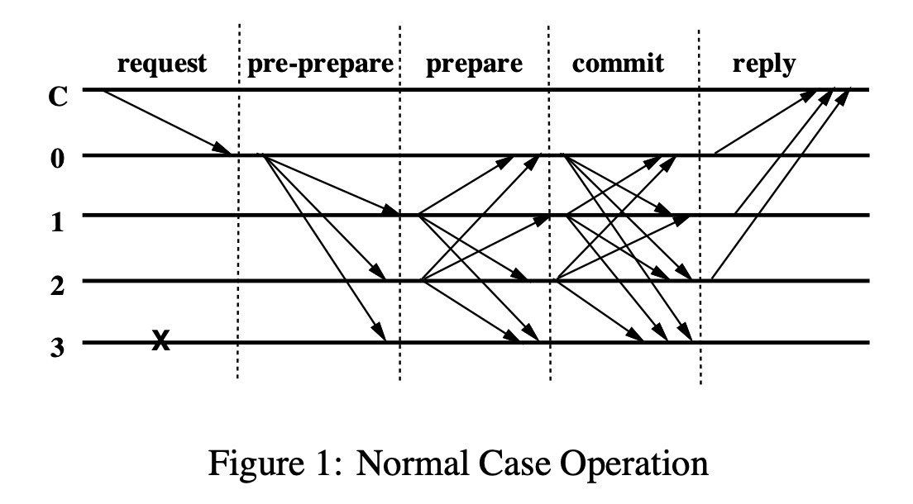

# Practical Byzantine Fault Tolerance (1999) 

Link: https://pmg.csail.mit.edu/papers/osdi99.pdf

Data: June 30th, 2024. 

- PBFT is **efficient** replication protocol extended from Viewstamp Replication that allows the group to survice **Byzantine (arbitrary) failures**. By this time, there was a realization that malicious attacks and Byzantine behavior needed to be dealt with.
- Asynchronous environment (no timeouts). Prior works are either too efficient to be used in practice, or assumes synchrony (relying on known bounds on message delays and process speed). Synchrony assumption is dangerous, as delaying non-faulty nodes or the communication between them until they are tagged as faulty and excluded from the replica group. 
- Describes the first state-machine replication protocol that correctly survives Byzantine faults in asynchronous networks.
- A key assumption is that: we assume independent node failures. Each node should run different implementations, etc. Adversary is able to coordinate and delay correct nodes, but they cannot delay correct nodes indefinitely. Adversary are computationally bound so that it is unable to subvert cryptographic techniques. 
> The algorithm does not rely on synchrony to provide safety. Therefore, it must rely on synchrony to provide liveness; otherwise it could be used to implement consensus in an asynchronous system, which is not possible.

## Key Motivation 
- Traditional replication protocol (e.x. Paxos, Raft, VR) does not survive Byzantine failures, which are more commonly seen back in the time in forms of mailicious attack, software errors, and so on. 
- Exsiting BFT algorithms assume synchrony for safety, but this is dangerous since a malicious attacker can delay messages through DoS, and also they are inefficient. 

## Setup 
### System model 
* Byzantine faults: allow replicas to behave arbitrarily (e.x. not reply, reply bad, accept request but discard state)
* Partial synchrony model: message eventually delivered

### Replica Group 
* Up to $f$ replicas are faulty
* Use $3f+1$ replica group
    *  $N$ replicas, tolerate $f$ non-replies (as they *can be* faulty)
    *  Then get $N - f$ replicas, worst-case contains $f$ Byzantine faulty replicas. (basically we got the previous *f* replicas wrong)
    *  $N - f - f$ none-faulty nodes needs to be larger than $f$ faulty nodes to reach agreement
    *  So $N - 2f > f$, we get $N$ is at least $3f+1$

> The resiliency of our algorithm is optimal: $3f+1$ is the minimum number of replicas that allow an asynchronous system to provide the safety and liveness properties when up to $f$ replicas are faulty. This many replicas are needed because it must be possible to proceed after communicating with $n-f$ replicas, since replicas might be faulty and not responding. However, it is possible that the replicas that did not respond are not faulty and, therefore, of those that responded might be faulty. Even so, there must still be enough responses that those from non-faulty replicas outnumber those from faulty ones, i.e., $n-2f > f$. Therefore $n > 3f$.

### Algorithm

* The set of replicas is $|R|$. 
* View $v$.
* The **primary** of a view is replica $p$ such that $p = v \mod |R|$.
* The algorithm goes as follows:
  * A client executes a request to invoke a service operation to the primary.
  * Primary multicasts the request to the backups.
  * replicas execute the request and send a reply to the **client** (not the primary).
  * The client waites for $f+1$ replies from different replicas with the same result.
  * If the client does not receive the replies soon enough, it broadcasts the request to all replicas. If the request has already been processed, the replicas re-send the reply. Otherwise, if the replica is not the primary, it relays the request to the primary. If the primary does not mutlicast, it will be suspected as faulty.

### Normal case operation:

* pre-prepare, prepare and commit. 
* Pre-prepare (**FROM the primary**):
  * The request is assigned a **sequence number** $n$ in **view** $v$ (This is the same as viewstamp replication).
  * add a sequence numebr $n$ to the request; **but do not attach the actual message.**
  * If the backup/replica accepts the pre-pare message, it enters *prepare* state and multicasts the prepare message to all other replicas including the message sent by the primary. 
  * This is important as the message contained is used as a proof later if the primary is revealed to be faulty. 
* Prepare phase starts. Each backup node multicasts a `PREPARE` type message to all the other nodes and adds both the `PRE-PREPARE` and `PREPARE` message to its local log.
* A replica $i$ becomes **prepared**:
  * Check signature and view number first. 
  * If the replica $i$ has received the request $m$, a pre-pare for $m$ in view $v$ with sequence number $n$, and $2f$ prepares for $m$ in view $v$ that match the pre-pare
  * The pre-pare and prepare phases of the algorithm guarantees that non-faulty replicas agree on a total order for the requests within a view. 
* After a replica is prepared, it multicasts a `COMMIT` message to all other replicas.
* Each replica ensures that prepare phase was successful and it has accepted 2f + 1 ‘COMMIT’ type messages from different replicas that match the pre-prepare for the request. If everything so far is successful, then the replica executes (or computes) the request. The commit phase now ends.
* A replica sends the ‘REPLY’ type message to the client. The message contains (1) information of view number (similar to block height), (2) timestamp, (3) result of executing the requested operation, and (4) the unique number of replica who sends this message.
* The client waits for f+1 valid replies from different replicas before finally accepting the result of the operation.

* 

> $committed(m,v,n)$ is true if and only if $prepared(m,v,n,i)$ is true for all $i$ in some set of $f+1$ non-faulty replicas; and $committed-local(m,v,n,i)$ is true if and only if $prepared(m,v,n,i)$ is true and has accepted $2f+1$ commits (possibly including its own) from different replicas that match the pre-prepare for $m$;

> The commit phase ensures the following invariant: if $committed-local(m,v,n,i)$ is true for some non-faulty $i$ then $commited(m,v,n)$ is true. 

Checkpoint:
> When a replica produces a checkpoint, it multicasts a message $(CHECKPOINT,n,d,i)$  to the other replicas, where $n$ is the sequence number of the last request whose execution is reflected in the state and is the digest of the state. Each replica collects checkpoint messages in its log until it has $2f+1$ of them for sequence number $n$  with the same digest $d$ signed by different replicas (including possibly its own such message). These $2f+1$ messages are the proof of correctness for the checkpoint.
Once a checkpint with a proof becomes stable and the replica disards all pre-pare, prepare, and commit messages with sequence number less than or equal to $n$ from its log. The checkpoint protocol is used to advance the low and high water marks (which limit what messages will be accepted). The low-water mark is equal to the sequence number of the last stable checkpoint. The high water mark , where is big enough so that replicas do not stall waiting for a checkpoint to become stable. 

### View Change Protocol

- But what if the primary replica is a Byzantine node? It would take forever to make a consensus if the primary stops multicasting any messages. This is totally possible in an asynchronous network setting where infinite message delay is acceptable behavior. As we know already, PBFT introduces time-out i.e., synchrony to solve this critical problem to the liveness property: distributed system eventually achieves consensus.

> If the timer of backup expires in view $v$, the backup starts a view change to move the system to view $v+1$. It stops accepting messages (other than checkpoint, view-change, and new-view messages) and multicasts a $VIEW-CHANGE, v+1, i$  message to all replicas.

If the primary $p$ of view $v+1$ receives $2f$ valid view-change messages for view $v+1$ from other replicas, it multi-casts a new $NEW-view, v+1$ message to all other replicas. 

The primary determines the sequence number $min-s$ of the latest stable checkpoint in and the highest sequence number $max-s$ in a prepare message in $V$. Replicas redo the protocol for messages between $min-s$ and $max-s$, but they avoid re-executing client requests. 

### Architecture
* Primary: order client request
    * execute and reply
* Client: monitor primary, do view-change if necessary
* Difference v.s VR
    *  #1: Replicas are Byzantine
    *  #2: Adversary can control the network: remove messages, corrupt them, etc.
*  Approach     
    *  #1: 3-phase protocol to tolerate $f$ byzantine
    *  #2: use cryptography - all msgs signed by senders
        *  goal: ensure secret keys used by honest is not known to adversay

### Security techniques
Goal: Prevent spoofing and delays and corrupting messages

Techniques 
*   Public-key signature: one cannot impersonate other
      *   E.x. messages between clients and the primary 
*   Message authentication code, collision-resistent hash, digest: one cannot tamper other's meesages
      *   Digest: crytographic hash of a piece of data, reduce amount of data to be sent
      *   Collision-resistent hash: infeasible to find two different inputs that produce the same hash output 
 
## Protocol: trust group not individuals 

### Normal Operation Protocol 

* Why pre-prepare stage? 
      *   Basic idea: Replica can be faulty! (i.e. assign wrong timestamp, etc.)

### View Change Protocol 

*   _certificate_: a collection of matching valid signed messages from $2f+1$ different replicas, representing **a proof that certain thing has happened**
      *   messages are signed, so replica is able to evaluate a certificate and decide for itself whether it is valid    
*  Need to use PREPARE certificates (i.e. composed of the messages replicas received while running the protocol)
      *  Consists of the PREPREPARE message from primary and $2f$ PREPARE message all for the same request( i.e. represented as the message digest) from the same viewstamp. 

### Limitations 
- Drawback: all-to-all communication with $O(n^2)$ 
  - There is one more weakness in the PBFT algorithm: heavy network consumption. To finalize a single view, the system requires roughly three phases that need for the message multicast. One-to-many messaging protocol consumes network bandwidth exponentially even though the number of participant nodes grows linearly
