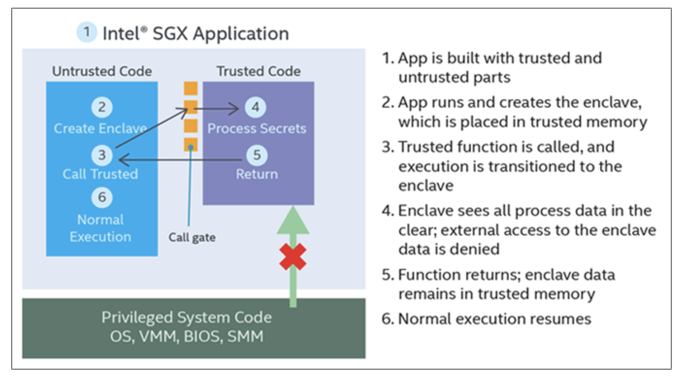

# Secure enclave and edge computing 

Reference: 
* https://opaque.co/what-are-secure-enclaves/
* https://www.trentonsystems.com/blog/what-is-intel-sgx
  
## Why secure enclave? 
_Purpose_: Create a secure environment for data processing where you don't have to **trust service providers**.

## Secure Enclave 
_definition_: a specialized area in computing that's isolated from everything else, including the operating system and users with high-level access.

-  Ensures that **not even users with root access** can see or interfere with the data or code in the enclave

### Comparisons with traditional encryption 
* Data protection types 
  * Data-at-rest: stored data (e.g. hard drives) 
  * Data-in-motion: data being transferred (e.g. over internet) 
  * Data-in-use: data being actively used or processed
* _Current state_: most systems protect data-at-rest and data-in-motion with encryption technologies like SSL/TLS
* _Problem_: data-in-use is vulnerable, you must trust the application and the platform it runs on
    *  access control: suspectible for human error, does not protect against info leakage
    *  homomorphic encryption (HE): allow compute on encrypted data, but too slow  

## Intel's SGX 
Intel's Software Guard Extensions (SGX) offers **hardware-based** security. 
* Memory protection: create a "safe box" within your computer's memory that's encrypted and accessible to only specific code (running within the enclave)
* Computing environment: where code to be executed is protected, even the OS cannot access it
* At runtime, SGX builds an encrypted area in memory. Code and data can freely operate inside this area but are encrypted when stored or moved outside it, preventing unauthorized access.
   

>At runtime, Intel SGX instructions build and execute the enclave into **a special encrypted memory region** with **restricted entry/exit location** defined by the developer.

## Use cases 
With a secure enclave environment, parties can finally efficiently collaborate by contributing individual data for some larger computation without other parties or any third parties ever learning any private data. 

This is suitable for 
* Runtime applications, protected through execution with SGX
* Securing IoT edge device communication between cloud and client
* Collaborative computing, financial services, healthcare, manufacturing, etc. 

Example steps
1. _Initial Communication_: User communicates with the cloud service via SSL/TLS to establish a secure channel.
2. _Remote Attestation_: Intel SGX enclave on the cloud server can provide a proof of its legitimacy through remote attestation. This ensures the user that they are communicating with a genuine, secure enclave.
3. _Encrypting the Images_: User uses a symmetric (asymmetric) encryption algorithm to encrypt the sensitive medical images. 
4. _Transmitting the Encrypted Images and Key_: The encrypted images and encryption key are sent to the cloud server over secure channel.
5. _Enclave Processing_: The enclave decrypts and subsequently processes the images, maintaining the confidentiality and integrity of the sensitive data.
6. _Storing Encrypted Images_: storing and receiving encrypted data outside enclave does not expose sensitive information
