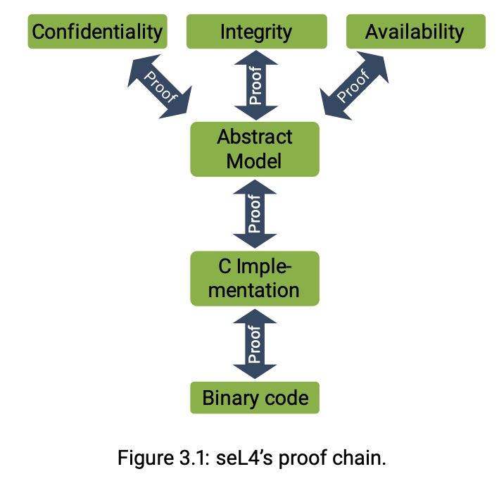
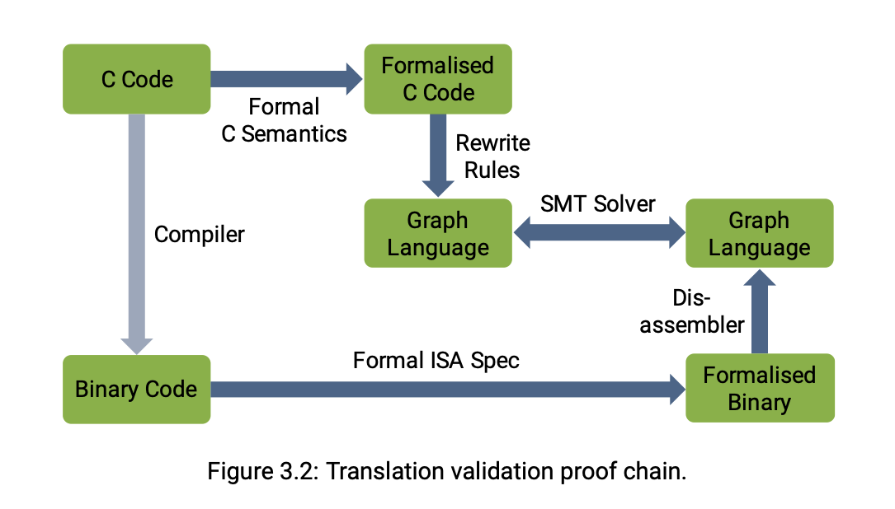

# seL4: Formal Verification of an OS Kernel (2009) 

Link: http://web1.cs.columbia.edu/~junfeng/09fa-e6998/papers/sel4.pdf

Resources: https://sel4.systems/About/seL4-whitepaper.pdf

June 29th, 2024. 

SeL4 is a microkernel: 

SeL4 now can even be a hypervisor, running VMs like Linux mainstream OS.

The core of seL4’s verification is the functional correctness proof, which says that the C implementation is free of implementation defects. More precisely, there is a formal specification of the kernel’s functionality, expressed in a mathematical language called higher-order logic (HOL). This is represented by the box labelled abstract model in the figure. The functional correctness proof then says that the C implementation is a re- finement of the abstract model, meaning the possible behaviours of the C code are a subset of those allowed by the abstract model.

How do we show that the compiler is fine? SeL4 also checks a representation of the binary with the that of the C Code. 

In addition to pointers, a capability also encodes access rights, in fact, the capability is an encapsulation of an object reference and the rights it conveys to that object. In a capability-based system, such as seL4, invoking a capability is the one and only way of performing an operation on a system object.

This paper presents the experience in performing the formal, machine-checked verification of the seL4 microkernel from an abstract specification down to its C implementation. This is the first formal proof of functional correctness of a complete, general-purpose operating-system kernel; assuming the correctness of the compiler, assembly code, boot code, managements of caches, and the hardware. 

The authors implement the OS first in Haskell to prototype proofs and refine the spec. Then, they implemented it in C and then used the spec to verify their C implementation. This enables high performance while ensuring correctness. Some parts of the verification steps seem to be manual. But it seems to ensure confidence that correctness is preserved.

As observed above, capabilities provide fine-grained access control, in line with the se- curity principle of least privilege (also called principle of least authority, short POLA). This is in contrast to the more traditional access-control model of access-control lists (ACLs), which are used in mainstream systems such as Linux or Windows, but also in commercial, supposedly secure systems, such as INTEGRITY or PikeOS.
To understand the difference, consider how access control works in Linux: A file (and the file model applies to most other Linux objects) has an associated set of access- mode bits. Some of these bits determine what operations its owner can perform on the file, others represent the operations permitted for each member of the file’s “group”,

and a final set gives default rights to everyone else. This is a subject-oriented scheme: It is a property of the subject (the process that is attempting access) that determines the validity of the access, and all subjects with the same value of the property (user ID or group ID) have the same rights. Moreover, these subjects have the same rights to all files with the same settings of the access properties.
This is a very coarse-grain form of access control, and is a fundamental limitation on what security policies can be enforced. A typical scenario is that a user wants to run an untrusted program (downloaded from the internet) to process a particular file but wants to prevent the program from accessing any other files the user has access. This is called a confinement scenario, and there is no clean way to do this in Linux, which is the reason people came up with heavyweight workarounds (I like to call them hacks) such as “chroot jails”, containers etc.
With capabilities, this problem is straightforward to solve, as capabilities provide an object-oriented form of access control. Specifically, the kernel will allow an operation to go ahead if and only if the subject that requests the operation presents a capability that empowers it to perform the operation. In the confinement scenario, the untrusted app can only access files to which it has been given a capability. So Alice invokes the program, handing it a capability to the one file the program is allowed to read, plus a capability to a file where the program can write its output, and the program is unable to access anything else – proper least privilege.

Capacbility-based access control. In such a system, Alice needs to hold three capabilities: an execute capability on the compiler, a read capability on the input file, and a write capability on the output file. She invokes the compiler with the execute capability and passes the other two as arguments. When the compiler then opens the output file, it does so with the capability provided by Alice, and there is no more confusion possible. The compiler uses a separate capability, which it holds itself, for opening the log file, keeping the two files well separated. In particular, it is impossible for Alice to trick the compiler into writing to a file she has no access to herself.
> This means that denomination (the reference to the file) and authority (the right to perform operations on the file) must be coupled, a principle called no designation without authority. This is exactly what a capability system enforces

### ummary

> Complete formal verification is the only known way to guarantee that a system is free of programming errors
> 

This paper presents the experience in performing the formal, machine-checked verification of the seL4 microkernel from an abstract specification down to its C implementation. This is the first formal proof of functional correctness of a complete, general-purpose operating-system kernel; assuming the correctness of the compiler, assembly code, boot code, managements of caches, and the hardware.

> We have created a methodology for rapid kernel de- sign and implementation that is a fusion of traditional operating systems and formal methods techniques. We found that our verification focus improved the design and was surprisingly often not in conflict with achieving performance.

### Verification

> The central artefact is the Haskell proto- type of the kernel. The prototype requires the design and implementation of algorithms that manage the low-level hardware details. To execute the Haskell prototype in a near-to-realistic setting, we link it with software (derived from QEMU) that simulates the hardware platform. Normal user-level execution is enabled by the simulator, while traps are passed to the kernel model which computes the result of the trap. The prototype modifies the user-level state of the simulator to appear as if a real kernel had executed in privileged mode.

Subset of language Huskell that can be translated into the language of the theorem prover we use. 

Translation from Huskell to C as the Huskell runtime is bulky. 

### Insights

- Microkernels are so small so that they can be formally verified!

### Techniques

Kernel Design Process 

- OS developers tend to take a bottom-up approach to kernel design
- Formal methods practitioners tend toward top-down design
- Use functional programming language Haskell to provide a programming language for OS developers, while at the same time can be translated into theorem proving tool
- Re-implement it in C
    - Haskell runtime is significant body of code, relies on GC that is unsuitable for real-time environments

- Abstract specification
    - Isabelle / HOL (Higher Order Logic) code
    - Describes what the system does without saying how it is done, like functional behavior of kernel operations
    - Example: scheduling, no scheduler policy is defined at abstract level
    - Make use of non-determinism in order to leave implementation choices to lower levels

- Executable specification
    - Haskel
    - Generated from Haskell into the theorem prover and fills in the details left open at the abstract level, and to specify how the kernel works as opposed to what it does
    - Deterministic; the only non-determinism left is the underlying machine
- C implementation
    - The most detailed layer in the verification
    - The translation from C into Isabelle is correctness-critical and model the semantics of C subset precisely and foundationally
- Machine model
    - Programming in C is not sufficient for implementing a kernel, like assembly
    - The basis of this formal model of the machine is the internal state of the relevant devices, collected in one record machine_state

Proof 

Use a refinement proof. 
> A refinement proof establishes a correspondence between a high-level (abstract) and a low-level (concrete, or refined) representation of a system.

- Prove by showing formal refinement
- To show that a concrete state machine $M_2$ refines an abstract one $M_1$, it is sufficient to show that for each transition in $M_2$ that may lead from an initial state $s$  to a set of states $s',$ there exists a corresponding transition on the abstract side from an abstract state $\sigma$ to a set $\sigma'$
- The transitions correspond if there exists a relation $R$   between the states $s$ and $\sigma$ such that for each concrete state in $s'$ there is an abstract one in $\sigma'$ that makes $R$   hold between them again
- Let
    - machine $M_A$ denote the system framework instantiated with the abstract specification
    - machine $M_E$  represent the framework instantiated with the executable specification
    - machine $M_c$  stand for the framework instantiated with the C program read into the theorem prover
- Theorem 1: $M_E$ refines $M_A$
- Theorem 2: $M_C$ refines $M_E$
- Theorem 3: $M_C$  refines $M_A$

### Limitations

- I think I don’t understand this paper to be honest…

### Questions

- Modularity design: change to global invariants and re-verify stuff
    - Verify components
    - Verify exception handlings: meet the specification v.s OS meeting the specification
    - Wrong behavior instead of crashing
    - Just verifying the error handling
- Alternative approach to build a safe kernel: high-level language
    - Runtime checks and other features
    - Write in goal: https://www.usenix.org/conference/osdi18/presentation/cutler
    - Problem we can solve for
        - Similar to type safety
        - The language can solve subset of the problem
        - More about: programmability rather than safety
- Modular approach, make changes, easier to iterate through the changes
    - Microkernel is setup to be more modular
