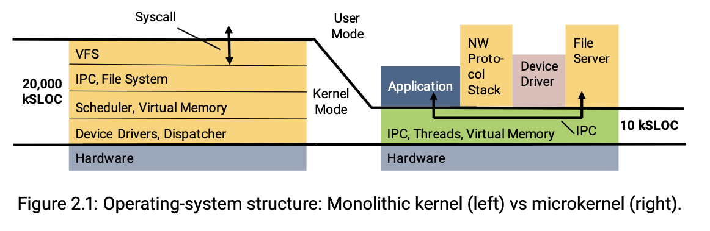

# Microkernel

Resources: https://sel4.systems/About/seL4-whitepaper.pdf

In fact, the microkernel provides almost no services: it is just a thin wrapper around hardware, just enough to securely multiplex hardware resources. What the microkernel mostly provides is isolation, sandboxes in which programs can execute without interference from other programs.

And, critically, it provides a protected procedure call mechanism, for historic reasons called IPC. This allows one program to securely call a function in a different program, where the microkernel transports func- tion inputs and outputs between the programs and, importantly, enforces interfaces: the “remote” (contained in a different sandbox) function can only be called at an ex- ported entrypoint, and only by explicitly authorised clients