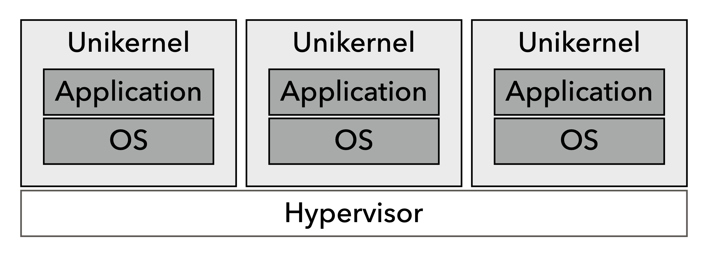

# Unikernels

June 29th, 2024.

### Key ideas

* Instead of OS on top of VMM, use simple library kernel that get's optimized into a application specific binary
* Dead code elimination so code size is smaller and simpler
* Strongly typed library OS leads to fewer bugs and increased security
* Faster overall since system calls become procedure calls over the VMM abstraction
* Result: faster OS with less code and 50ms boot times

### From Slides
* Unikernel = Exokernel + container
* Run one application per VM. One process per application. Everything compiled into VM image. Do not compile unused code.
* Specialized unikernel = {application code, mirage runtime. }
* Mirage compiler combines application source code, configuration files, hardware architecture, whole-system optimizations. 

### Exokernel vs. Unikernel
* Exokernel
  * Fast and customizable
  * All applications on same system
  * Poor isolation
* Unikernel
  * Fast and customizable
  * Single application per system
  * Better isolation

Reference: 
* https://github.com/parasj/papers/blob/master/os_structures/unikernel.md
* https://www.cs.cornell.edu/courses/cs6410/2017fa/slides/08-extensible-kernels.pdf
