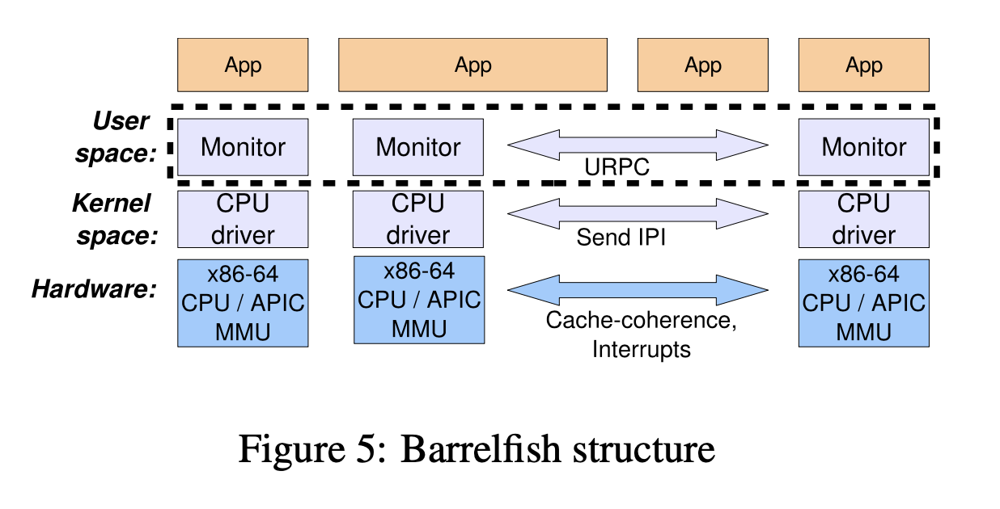

# The Multikernel: A New OS Architecture for Scalable Multicore Systems (2009)
Reference: https://github.com/parasj/papers/blob/master/os_structures/multikernel.md

Link: https://www.sigops.org/s/conferences/sosp/2009/papers/baumann-sosp09.pdf

June 29th, 2024. 

Increasing heterogenity and scalability in hardware (i.e. CPU cores) motivates modeling multicore systems as distributed systems. Three principles guide multikernel design 

(1) make all inter-core communication explicit via **message passing**
* Machine as a netwokr of *independent* cores.
* No inter-core sharing.

(2) make all OS structure **hardware-neutral** via separating OS structure from the hardware

(3) **replicate state** across cores instead of sharing state.
- Note that this does not preclude applications sharing memory between cores (see Section 4.8), only that the OS design itself does not rely on it.

The main argument is about scalability to future hardwares, by treating computer as a network of cores. 

- instead of sequentially manipulating shared data structures, which is limited by the latency of re- mote data access, the ability to pipeline and batch mes- sages encoding remote operations allows a single core to achieve greater throughput and reduces interconnect utilization.
- This is the paper on **Barrelfish**
- Core heterogeneity means cores can no longer share a single OS kernel instance, either be- cause the performance tradeoffs vary, or because the ISA is simply different.
- Shared memory model has an inherent lack of scalability: 
  - Although a single core can perform the update operation in under 30 cycles, when 16 cores are modifying the same data it takes almost 12,000 extra cycles to perform each update. All of these extra cycles are spent with the core stalled on cache misses and therefore unable to do useful work while waiting for an update to occur.
- Message passing has two issues:
  - There are two principal concerns, the first to do with not being able to access shared data, and the second to do with the event-driven programming style that results from asynchronous mes- saging.
-  design and reason about the OS as a distributed, non-shared system, and then employ sharing to optimize the model where appropriate.
-   we propose an OS archi- tecture positioned at the extreme right of the spectrum, where all state is replicated by default and consistency is maintained using agreement protocols
- Message passing allows operations that might require communication to be split-phase, by which we mean that the operation sends a request and immediately continues, with the expectation that a reply will arrive at some time in the future.

## Message passing v.s shared memory 
Ousterhout describes that core speed is increasing faster than disk and memory latency. So operating systems still block on memory and disk. Message passing is more efficient than shared memory at scale. So the multikernel embraces message passing (much like Mach).

- However, the drawback of a idealist message-passing abstraction here is that certain platform-specific performance optimizations may be sacrificed, such as making use of a shared L2 cache between cores.

- Not only that, the model supports multiple implementations of the agreement pro- tocols used to maintain consistency. This increases the burden on the developer who must understand the con- sistency requirements for the data, but on the other hand, can also precisely control the degree of consistency.

we factor the OS instance on each core into a privileged-mode CPU driver and a distinguished user- mode monitor process. CPU drivers are purely local to a core, and all inter-core coordination is performed by monitors. The distributed system of monitors and their associated CPU drivers encapsulate the functional- ity found in a typical monolithic microkernel: schedul- ing, communication, and low-level resource allocation.

Device interrupts are routed in hardware to the appropriate core, demultiplexed by that core’s CPU driver, and delivered to the driver process as a message.

a CPU driver abstracts very little but performs dispatch and fast local messaging be- tween processes on the core. It also delivers hardware interrupts to user-space drivers, and locally time-slices user-space processes. The CPU driver is invoked via standard system call instructions with a cost comparable to Linux on the same hardware.

Monitors collectively coordinate system-wide state, and encapsulate much of the mechanism and policy that would be found in the kernel of a traditional OS. The monitors are single-core, user-space processes and there- fore schedulable. Hence they are well suited to the split-phase, message-oriented inter-core communication of the multikernel model, in particular handling queues of messages, and long-running remote operations.

A process in Barrelfish is represented by a collec- tion of dispatcher objects, one on each core on which it might execute. Communication in Barrelfish is not ac- tually between processes but between dispatchers (and hence cores).

Barrelfish at present therefore uses a variant of user-level RPC (URPC) [10] between cores: a region of shared memory is used as a channel to transfer cache-line-sized messages point-to-point between single writer and reader cores.  At present, dispatchers poll incoming channels for a predetermined time before blocking, however this can be improved by adaptive strategies similar to those used in deciding how long to spin on a shared-memory spinlock.

All virtual memory management, including allocation and manipulation of page tables, is performed entirely by user-level code

A shared virtual address space can be achieved by ei- ther sharing a hardware page table among all dispatch- ers in a process, or replicating hardware page tables with consistency achieved by message protocols.  the former is typically more efficient, how- ever the latter may reduce cross-processor TLB invali- dations (because it is possible to track which processors may have cached a mapping), and is also the only way to share an address space between cores that do not support the same page table format.

Barrelfish employs a service known as the sys- tem knowledge base (SKB) [60], which maintains knowl- edge of the underlying hardware in a subset of first-order logic

As one example, we describe in Section 5.1 how the SKB is used to construct a cache- and topology-aware network for efficient communication within multicore machines.
