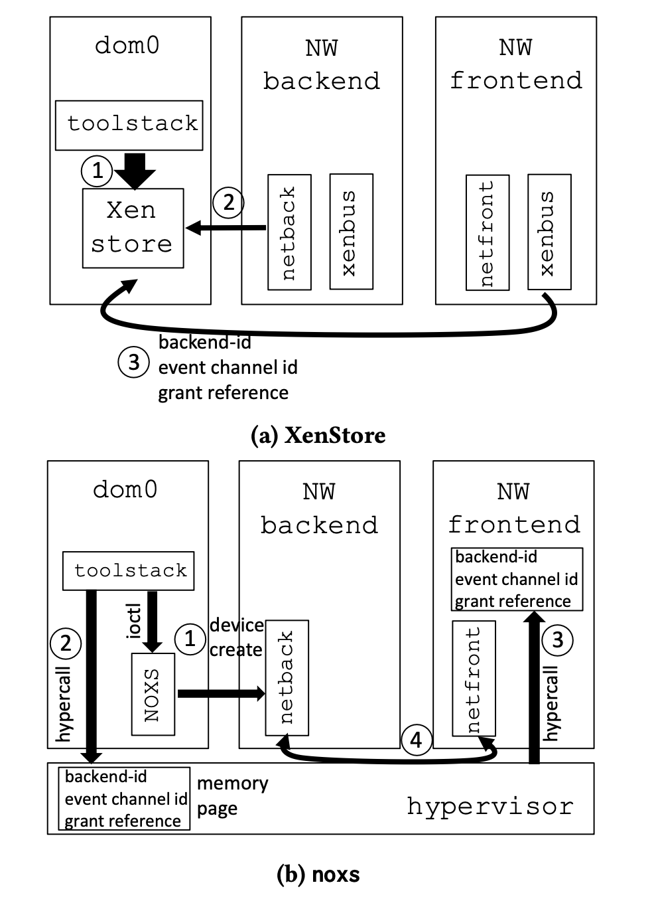

# My VM is Lighter (and Safer) than your Container (2017)
The paper addresses the trade-off between isolation and efficiency in Virtual Machines (VMs) and containers. While containers are lightweight, they lack the security guarantees that VMs provide. The paper proposes techniques based on Xen to make VMs as efficient as containers without compromising on security.

Lightweight VMs use unikernels.
* A unikernel is a machine image that contains everything necessary for application execution, including the operating system component. This property makes unikernels completely self-sufficient and able to run independently on top of a bare metal hypervisor.

## Tradeoffs 
Containers are lightweight but less secure, while VMs offer strong isolation at the expense of being resource-heavy and slow to boot.
  * Secure many syscalls.
  * To complicate matters, any container that can monopolize or exhaust system resources (e.g., memory, file descriptors, user IDs, forkbombs) will cause a DoS attack on all other containers on that host
*  Why is container less secured?
    *  shared kernel 
    *  containers use large # of syscall APIs to interact with HostOS, larger attack surface 
Downside of VM:
* Size:  for instance, both the on-disk image size as well as the running memory footprint are on the order of hundreds of megabytes to several gigabytes for most Linux distributions. 

## Key technique 
Unikernels: create minimalistic VMs where a pared-down OS is directly linked to the application.
* Unikernels: tiny virtual machines where a minimalis- tic operating system (such as MiniOS [34]) is linked di- rectly with the target application.
* Tinyx: a tool that we have built to create a tiny Linux distribution around a speci￿ed application.
  * The Tinyx build system takes two inputs: an application to build the image for (e.g., nginx) and the platform the image will be running on (e.g., a Xen VM).
* An image that are a few MBs in size.

 The insight here is that the hypervisor already acts as a sort of centralized store, so we can extend its functionality to implement our noxs (no XenStore) mechanism.

1. Lightweight guest: TinyX 
   *  automate creations of trimmed-down Linux VMs just enough to run the applications
   *  take standard Linux Distro and make it smaller 
2. Re-architect toolstack
   *  re-architect Xen's toostack (i.e. control plane)
       *  get rid of Xenstore: store data, guest comm, sync
       *  use shared memory and event channel for communication     
       *  using instead a lean driver called noxs that addresses the scalability problems of the XenStore by enabling direct communication between the frontend and backend drivers via shared memory instead of relaying messages through the XenStore
          *  Shared memory reduces the number of software interrupts and domain crossing for VM operations.
       *  Separate VM creation functionality into a prepare and execute phase.
   *  optimized to offer fast boot-times that scale to large # of VMs  
   *  Hypervisor creates special device memory pages for each VM. Only `Dom0` can request modifications. 
   *  Hypercall to write to and read from this memory page.
   *  When a VM create command is issued, it does not actually need to run a VM at VM creation time.
      *  A lot of code is common to all VMs.
      *  VMs can be pre-executed and off-loaded from the creation process (having the hypervisor generates an ID, allocating CPU resources.)
      *  Execute
         *  Asking for shell fitting the VM. Loading the kenrel image into memory. Finalizing device initialization.

## Use cases 
JIT service instantiation in mobile edge computing, lightweight compute services like AWS Lambda 

LightVM exposes a clear trade-of between performance and portability/usability. Unikernels provide the best per- formance, but require non-negligible development time and manual tweaking to get an image to compile against a target application. Further, debugging and extracting the best per- formance out of them is not always trivial since they do not come with the rich set of tools that OSes such as Linux have

The use cases we presented show that there is a real need for lightweight virtualization, and that it is possible to si- multaneously achieve both good isolation and performance on par or better than containers. However, there is a devel- opment price to be paid: unikernels o￿er best performance but require signi￿cant engineering e￿ort which is useful for highly popular apps (such as TLS termination) but likely too much for many other applications. Instead, we have pro- posed Tinyx as a midway point: creating Tinyx images is streamlined and (almost) as simple as creating containers, and performance is on par with that of Docker containers