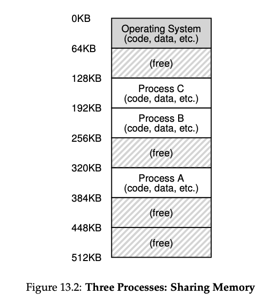
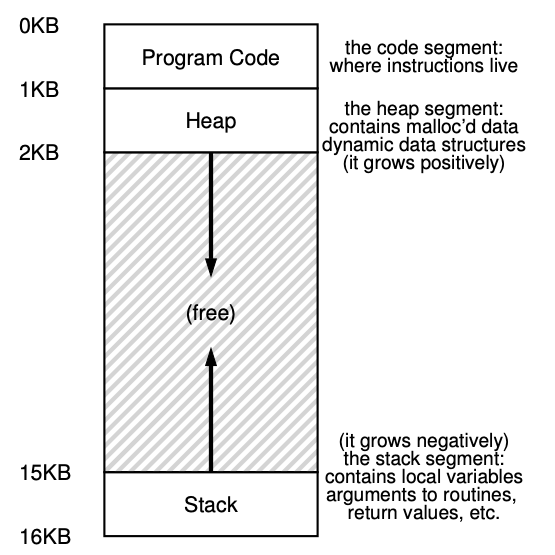

# Address Space

- Address space for a process 
  - Contains
    - Code
      - the instructions
    - Stack
      - Grows due to function calls, etc.
      - The program, while it is running, uses a stack to keep track of where it is in the function call chain as well as to allocate local variables and pass parameters and return values to and from routines.
    - Heap
      - heap is used for dynamically-allocated, user-managed memory, such as that you might receive from a call to malloc() in C or new in an object- oriented language such as C++ or Java. 
  - Why placing the stack and heap like this?
    - Each wishes to grow 
- 
- 
  - Code is static; placed at top; as it won't grow.
  - The heap thus starts just after the code (at 1KB) and grows downward (say when a user requests more memory via malloc()); the stack starts at 16KB and grows upward (say when a user makes a procedure call).
- Goals:
  - Address space: an easy to use abstraction of physical memory.
  - The address space of a process contains all of the memory state of the running program.
  - Transparency
    - Should behave as if it has its own private physical memory
    - OS does multiplexing among different jobs
  - Efficiency 
    - Time: not making the programs run much more slowly
    - Space: not using too much memory for structures needed to support virtualization
    - Need hardware support (i.e. TLBs)
  - Protection
    - Protect processes from one another
    - Isolation among processes  