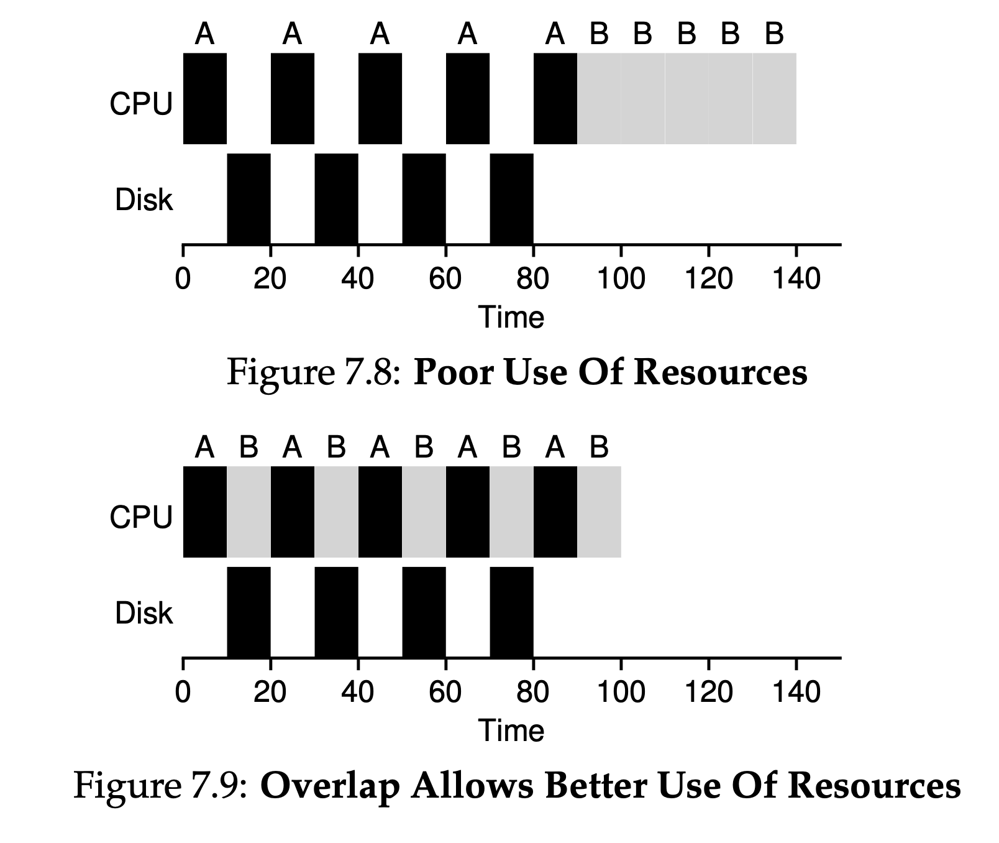

# Scheduling

- Assumptions:
  - Each job runs for the same amount of time
  - All jobs arrive at the same time.
  - Once started, each job runs to completion.
  - All jobs only use the CPU (i.e., they perform no I/O)
  - The run-time of each job is known.
- Scheduling metrics:
  - Turnaround time: the time at which the job completes
    - $T_{turnaround} = T_{completion} - T_{arrival}$
    - the time which the job arrived in the system 
  - Another metric: fairness, e.g. Jain’s Fairness Index 
  - Why is FIFO not great?
    - Convoy effect: # of relatively-short potential consumers of a resource get queued behind a heavyweight resource consumer 
  - SJF: If all jobs arrive at the same time, SJF is an **optimal** scheduling algorithm
    - However, if jobs arrive at different time:
      - Same convey problem
  - STCF: 
    - If we do not requite all jobs to run to completion:
    - Add **preemption** 
      - Any time a new job enters the system, the STCF scheduler determines which of the re- maining jobs (including the new job) has the least time left, and schedules that one. 
    - Better average turnaround time 
      - Given the new assumptions, STCF is provably optimal 
  - Response time: the time from when the job arrives in a system to the first time it is scheduled 
    - $T_{response} = T_{firstrun} - T_{arrival} $
  - SJF and STCF:
    - Bad for response time
  - Round Robin (Good for response time.)
    - Time-slicing
    - Runs the job for a time slice (or a scheduling quantum); switch to the next job in the run queue.
    - The shorter the time is, the better performance of RR under response time metric
    - Too short: cost of context switching dominates (i.e. CPU caches, TLBs, branch predictors, and other on-chip hardware)
    - Because turnaround time only cares about when jobs finish, RR is nearly pessimal, even worse than simple FIFO in many cases 
      - RR is worse for turnaround time. 
    - Any policy that is fair —> but perform poorly on metrics such as turnaround time
        - willing to be unfair —> run shorter jobs to completion, but at the cost of the response time
        - value fairness —> response time is lowered, but at the cost of the turnaround time
  - Incorperating I/O: overlapping leads to better use of resources. 
    - currently-running job won’t be using the CPU dur- ing the I/O; it is blocked waiting for I/O completion. 
    - The scheduler also has to make a decision when the I/O completes. When that occurs, an interrupt is raised, and the OS runs and moves the process that issued the I/O from blocked back to the ready state. Of course, it could even decide to run the job at that point. 
  - 
    - A common approach is to treat each 10-ms sub-job of A as an indepen- dent job. Thus, when the system starts, its choice is whether to schedule a 10-ms A or a 50-ms B. With STCF, the choice is clear: choose the shorter one, in this case A. Then, when the first sub-job of A has completed, only B is left, and it begins running. Then a new sub-job of A is submitted, and it preempts B and runs for 10 ms.
  

### FCFS (FIFO) 	First in, First Out 

Cons: average turnaround time can be high! 

- Convey effect: a number of relatively-short potential consumers of resource get queued behind a heavyweight resource consumer 
### SJF (shortest job first) 	
Improvement on FIFO: run the shortest first job first 

Pros: optimal scheduling algorithm for turnaround time given assumptions that jobs arriving at the same time 

Cons: same convey problem if we relaxed this assumption (i.e. schedule long A, then short B,C arrive) 
### STCF (shortest time-to-completion first) 	
Add preemption to SJF. 

Any time a new job enters the system, the STCF scheduler determines which of the remaining jobs has the least time left, and schedules that one. 
### Round Robin	
Instead of running jobs to completion, RR runs a job for a time slice (i.e. scheduling quantum), then switches to next job in the run queue. 

Note: length of time slice is critical
- Shorter, better response time, but higher context switch overhead 

Pros: built for high response time, fair 

Cons: perform bad for turnaround time, even worse than FIFO in many cases 
Priorities 	Schedule based on priority where the scheduler selects tasks based on priority (it is a general term) 
### MLFQ
Problem: we want to optimize turnaround and minimize response. we don’t know anything about a process (i.e. job length, etc.) 

Idea: 
- Number of distinct queues with different priority level: higher priority given more CPU time, lower given less 
 
- Priority adjusted dynamically based on its behavior, use a feedback mechanism 

- Each queue is assigned a time slice determine how much CPU time a process in that queue is allowed to use before pre-empted and moved to a lower level queue  

Pros: more flexible, allow different process to move between priorities, prevent starvation by increasing process’s priority

Cons: many tunable knobs: # of queues, time slice per queue, how often should priority be boosted, etc. 
### EDF	
Assign priorities to the task according to the absolute deadline. The task whose deadline is closet gets the highest priority. 

Pros: efficient in real time system, dynamic 

Cons: priority inversion (i.e. a low-priority task can block a higher priority task from being executed, if blocking?) 
### Proportional Share (Fair-Share) Scheduler 
Instead of optimizing for turnaround or response time, scheduler might instead try to guarantee that each job obtain a certain percentage of CPU time 

1. Lottery Ticket: use tickets to represent the share of a resource that a process should receive 
- Lightweight, randomness 
- But occasionally not deliver right proportions 

1. Stride Scheduling: not use randomness 
- Stride: inverse in proportion to # of tickets it has 
- use the stride and pass to determine which process to run next; pick process to run that has the lowest pass value so far, when you run a process, increment its pass counter by stride 

1. CFS 
- Linux CFS: highly efficient and scalable fair-share scheduler 
- Goal: fairly divide CPU evenly among competing processes 
- use virtual runtime (vruntime), weight with niceness to assign priorities 
- weighted round-robin with dynamic time slices 

- **Priority donation / inheritance**
    - Problem: priority inversion
        - Higher-priority task blocked by lower priority task that holds a needed resource (i.e. lock)
    - Low priority task inherits the high priority of a task it is blocking
    - Here's a simple example:
        1. **Low-Priority Task (L)** owns a mutex.
        2. **High-Priority Task (H)** tries to acquire the same mutex but is blocked because it's owned by **L**.
        3. **Medium-Priority Task (M)** preempts **L** because **M** has a higher priority than **L** but lower than **H**.
        
        Now, **H** is waiting for **L** to release the mutex, but **L** itself is waiting for CPU time because it's preempted by **M**. This is priority inversion.
        
        In a system with Priority Donation/Inheritance:
        
        1. When **H** is blocked by **L**, the system temporarily elevates the priority of **L** to that of **H**.
        2. Now, **L** can preempt **M** because it has "inherited" the higher priority.
        3. **L** quickly finishes its work, releases the mutex.
        4. **H** can now acquire the mutex and proceed, and **L** returns to its original low priority.

## Deadlock

- Deadlock is a specific condition where two or more processes are unable to proceed because each is waiting for the other to release a resource.
- Prevention
    - Resource allocation graph: use directed graph to represent resource allocation, avoid cycles
    - Timeout: set maximum time for acquiring resources