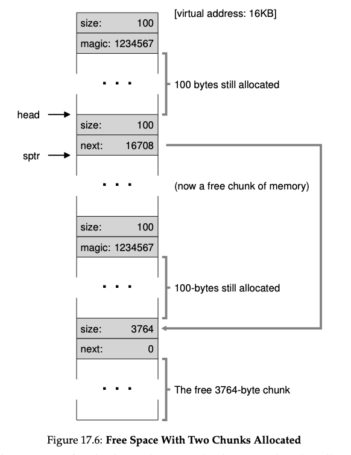
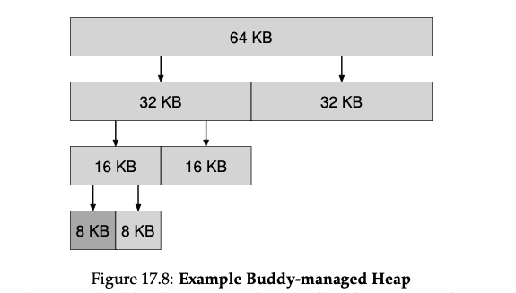

# Free-space management

- `free list`: structure to manage free space in the heap 
- **Splitting**: find a free chunk of memory that can satisfy the request and split it into two
    - The first chunk returned to the caller
    - The second chunk remains on the list
- **Coalescing**: coalesce free space when a chunk of memory is freed
    - Do merging
    - Can ensure that large free extents are available for the application
- You might have noticed that the interface to free(void *ptr) does not take a size parameter; thus it is assumed that given a pointer, the malloc library can quickly determine the size of the region of memory being freed and thus incorporate the space back into the free list.
- To accomplish this task, most allocators store a little bit of extra infor- mation in a header block which is kept in memory, usually just before the handed-out chunk of memory.
- the size of the free region is the size of the header plus the size of the space allocated to the user. Thus, when a user requests N bytes of memory, the library does not search for a free chunk of size N; rather, it searches for a free chunk of size N plus the size of the header.
  - Free list will point to the next chunk of free space, e.g.
  - 
- One interesting approach that has been around for some time is the use of segregated lists. The basic idea is simple: if a particular application has one (or a few) popular-sized request that it makes, keep a separate list just to manage objects of that size; all other requests are forwarded to a more general memory allocator.
- One particular allocator, the slab allocator by uber-engineer Jeff Bonwick (which was designed for use in the Solaris kernel), handles this issue in a rather nice way
- it allocates a number of object caches for kernel objects that are likely to be requested frequently (such as locks, file-system inodes, etc.); the object caches thus are each segregated free lists of a given size and serve memory allocation and free requests quickly.
- When a given cache is running low on free space, it requests some slabs of memory from a more general memory allocator (the to- tal amount requested being a multiple of the page size and the object in question). 
- Conversely, when the reference counts of the objects within a given slab all go to zero, the general allocator can reclaim them from the specialized allocator, which is often done when the VM system needs more memory
- Buddy Managed Heap
  - 
  - By using a buddy system, the allocator can quickly find a free block of memory of a given size, and can also quickly coalesce free blocks of memory when they are freed.
  - Check the buddy, recursively free the blocks. 