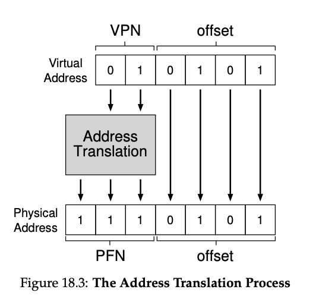

# Paging

- Paging: a new solution to virtualizing memory
  - Correspondingly, we view physical memory as an array of fixed-sized slots called page frames; each of these frames can contain a single virtual-memory page.
- Pros
    - Does not lead to external fragmentation, as it divides memory into fixed-sized units
    - Quite flexible: enable sparse use of virtual addr space
- Cons
    - Slower machine: many extra memory accesses
    - Memory waste: memory filled with page tables instead of useful application data
- OS takes two approaches to deal with space-management
    - Variable-sized pieces: segmentation
        - Cons: space can become fragmented, allocation challenging
    - Fixed-sized pieces: paging
        - Fixed-size unit: **page**
        - Physical memory is an array of fixed-sized slots called **page frames**
- Challenge
    - How can we virtualize memory with pages, so as to avoid the problems of segmentation?
    - What are the basic techniques?
    - How do we make those techniques work well, with minimal space and time overheads?
- **Page table**
    - **Per-process data structure** to record where each virtual page of the address space is placed in physical memory
    - Address translations for each virtual pages
        - E.x. four entry (0 —> 3, 1 —> 7, 2 —> 5, 3 —> 2)
    - **VPN:** virtual page number
    - **Offset:** within the page

Page table register (PTBR): contain physical address of starting loc of PT 
Form address of page table entry: PTE = PTBR + (VPN * sizeof(PTE)) 
  
## Where are page tables stored?
- Page tables can be bigger than small segment tables or base / bounds pairs
- Too large, not store in on-chip hardware in the MMU
- Store in memory instead

MMU: stores the base and bound register; as well as TLB.

- **Linear page table** 
    - Array 
    - OS indexes the page by VPN, then lookup the page table entry (PTE) at that index to find the PFN
- PTE 
    - ***Valid bit:*** indicate whether the particular translation is valid 
        - E.x. unused space in-between (code, heap, stack) is invalid, will generate a trap to the OS that likely terminate the process 
    - ***Protection bit:*** whether page could be read from, written to, or executed from 
        - Accessing a page in a way not allowed will trap 
    - ***Present bit:*** whether this page is in physical memory or on disk (i.e. it has been swapped out) 
        - E.x. swap parts of addr space to disk to support addr space larger than physical memory 
        - Actually no separate valid and present bit, just valid bit 
            - P = 0, might be valid or not, then OS use additional structure 
    - ***Dirty bit:*** whether the page has been modified since it was brought to memory 
    - ***Reference bit:*** track whether a page has been accessed 
        - Useful in determine which pages are popular in page replacement
- we can now index our page table and find which physical frame virtual page 1 resides within. In the page table above the physical frame number (PFN) (also sometimes called the physical page number or PPN) is 7 (binary 111).
  - 
- VPN -> PFN

- Sol #2: **page + segments**
    - Problem: most of the page table unused, full of invalid entries (e.x. between stack and heap)
    - Approach: one page table per logical segment
        - E.x. code, heap, stack
        - Have base and bound registers in MMU
            - Base: holds physical address of page table
            - Bound: holds the end of page table

- The page directory, in a simple two-level table, contains one entry per page of the page table
    - Page directory entries (PDE)
        - Has a **valid bit** and a **page frame number**
        - Valid bit: if PDE is valid, it means that at least one of the pages of the page table that entry points to (via the PFN) is valid

