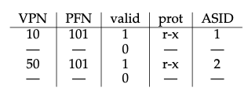

# Paging: Faster Translations (TLBs)

- Part of the chip’s memory-management unit (MMU)
- Simply a hardware **cache** of popular virtual-to-physical address translations
- Or: address-translation cache
- First check if the TLB holds the translation for this VPN, if it does, then TLB hit; if not, TLB miss
- Even though first time when the program access the array, TLB still improves performance due to **spatial locality**
    - If page size bigger, even fewer misses
    - Typical one: page size 4KB
- - Maintain virtual-to-physical translations that are only valid for the current running process
    - Flush on context switches
- **Temporal locality**: the quick re-reference of memory items in time
    - Access some items again
- **Hardware-managed TLBs**: hardware handles TLB miss entirely
    - HW has to know where the page tables are located in memory (via a page table base register) and their exact format
    - On TLB miss, HW walks the page table, and update TLB with translation, then retry
    - Previously
- **Software-managed TLB**
    - E.x. RISC
    - On TLB miss, HW raises an exception, which pauses the current instruction stream, raises the privilege level to kernel mode, and jumps to a **trap handler**
    - Note
        - Return-from-trap different from syscall
            - Instead of resume execution at instruction after the trap
            - We want to resume execution at instruction at caused the trap to retry
            - HW must save a different PC to resume correctly
        - OS needs to be careful of infinite chain of TLB misses
            - Solution: TLB miss handlers in physical memory, or reserve some entires in the TLB for permanently-valid translations for the handler code
    - Pros
    - Flexibility
        - OS can use any data structure it wants to implement the page table without HW
    - Simplicity
        - HW doesn’t do much on a miss, just raise an exception and OS TLB miss handler do the rest
- A typical TLB might have 32, 64, or 128 entries and be what is called fully associa- tive. Basically, this just means that any given translation can be anywhere in the TLB, and that the hardware will search the entire TLB in parallel to find the desired translation. A TLB entry might look like this:
- VPN | PFN | other | bits
- Note that both the VPN and PFN are present in each entry, as a trans- lation could end up in any of these locations (in hardware terms, the TLB is known as a fully-associative cache). The hardware searches the entries in parallel to see if there is a match.
- Context switch naively requires a TLB flush everytime. 
- To reduce this overhead, some systems add hardware support to en- able sharing of the TLB across context switches. In particular, some hard- ware systems provide an address space identifier (ASID) field in the TLB. You can think of the ASID as a process identifier (PID), but usu- ally it has fewer bits (e.g., 8 bits for the ASID versus 32 bits for a PID)
- 
- There are scenario where the program can generate large # of misses still
    - This is called exceeding the TLB coverage
        - Some solution: larger page size (i.e. in DBMS)