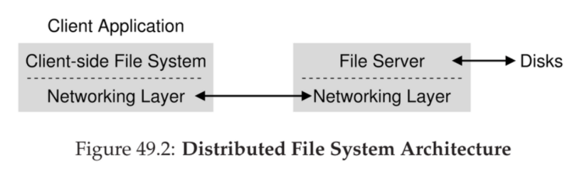
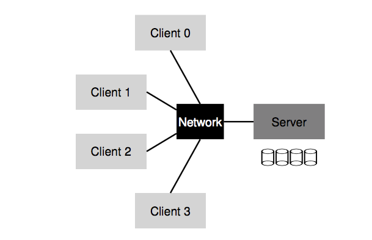

# Design and Implementation of the Sun Network Filesystem (NFS) (1985) 

Link: https://www.cs.ucf.edu/~eurip/papers/sandbergnfs.pdf

Read: June 25th, 2024.

NFS is a **distributed file system** designed to make sharing of filesystem resources in a network of non-homogeneous machines easier. Design goals are 

- Client-side FS: issue system calls, wants to have transparent access to files
- Server-side FS: reply to client request
- Benefits
    - Easy sharing of data across clients
    - Centralized administration (e.x. backing up files)
    - Security (e.x. secure servers)

1. **Crash recovery** (main goal): recover easily from server crashes
2. Transparency and UNIX semantics: access remote files as local 
3. **Reasonable performance**
4. Machine & os independence: being able to supply files to different types of clients 

## Techniques 
There are a few techniques used to achieve these goals 

### 1. Simple and fast recovery: _statelessness_
*  Stateless protocol: server does not keep track of anything about client
    *  most requests are **idempotent** (e.x. `LOOKUP`, `READ`, `WRITE`)   
*  Key structure: file handle (FD)
    *  <volume id, inode id, generation #>     
    *  - *Volume identifier* —> which FS the request refers to
       - NFS server can export more than one FS
   - *Inode identifier* —> which file within that partition the request is accessing
   - *Generation number* —> needed when reusing an inode number
       - Increment it whenever an inode number is reused
       - Ensure that a client with an old file handle can’t accidentally access the newly allocated file
*  Steps 
    *  every client RCP call pass a FD
    *  server fails: client retires
*  - Stateful protocol
    - Shared / distributed state complicates crash recovery
    - Server maintain a file descriptor to actual file relationship

### 2. Transparency: mounting
*  use `MOUNT` to attach a remote file system to a directory
*  Hostname lookup and address binding once per FS

### 3. Performance: caching 
#### 1) Client: R/W (cache consistency problem) 
   * _update visibility_: when do updates from client visible to others
       *  Sol: flush-on-close 
   * _stale cache_: server newer copy visible to other clients
       *  Sol: cache invalidation via `GETATTR` requests, with metadata cache

1. Two-fold 
    1. Cache file data (metadata) that it has read from server in client memory
    2. Cache as a temporary buffer for writes 
2. Problems in cache consistency 
    1. *Update visibility* - when do updates from one client become visible at other clients?
    2. *Stale cache* - once the server has a newer version, when do the clients become visible to this version over the old cache copy?

#### 2) Server: buffer writes 
* Performance v.s durability: if server crash
    *  put in battery-backed mem, or use faster medium to write
 
 
### 4. Machine & OS independences: VFS / Vnode interface 
- *Virtual File System (VFS)*: includes operations that are done to the entire file system
    - E.x. mounting, unmounting, getting FS-wide statistics, forcing dirty writes to disk, etc.
- *Virtual node (Vnode)*: includes all operations one can perform on a file
    - E.x. open, close, reads, writes, etc.
- - To build a new FS, one just needs to define these “methods”
- The framework will handle the rest
    - connecting sys calls to particular FS implementations
    - performing generic functions common to all FS (e.g. caching) in a centralized manner
    - and thus enabling multiple FS implementations to coexist in the same OS
 
## Problem 
Security in early NFS implementation was lax: easy for any user on a client to masquerade as other users and gain access to virtually any file 
Performance: though with caching, still a bunch of issues 